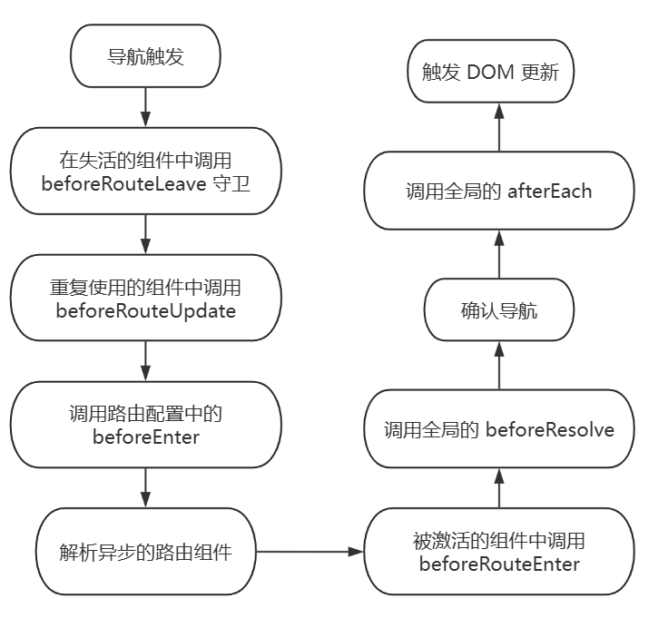

**前言：本篇浅谈下 Vue Router 的实现原理**
### 一、初始化过程
1. 使用 Vue router 是通过 new VueRouter 然后传入 routes 数组，即配置的每一个路由对象；源码中，VueRouter 是一个类，执行 new VueRouter 首先就是对 routes 路由数组进行处理，将所有的路由路径存放到一个数组 pathList 中，然后创建一个对象 pathMap 存储路径及其对应的路由记录 record 对象的映射关系；record 对象上有许多属性，包括 path 路径、components 路由对应的组件以及配置的 route 上的所有属性等等；record 对象在后续路由的跳转、更新、router-view 中的组件渲染有重要作用；
```js
// pathList 是一个数组，存储所有的路由
const pathLis = ["/", "/about", "/about/a"];
// pathMap 是一个对象，映射着路径和其对应组件的关系
const pathMap = {
    "/": {},
    "/about": {},
    "/about/a": {}
}
// record 对象
const record = {
    "path": "/about/a",
    "regex": {
        "keys": []
    },
    "components": {
        "default": {
            "template": "<div>A</div>"
        }
    },
    "alias": [],
    "instances": {},
    "enteredCbs": {},
    "parent": {
        "path": "/about",
        "regex": {
            "keys": []
        },
        "components": {
            "default": {
                "template": 
                `<div>
                    About
                    <router-link to=\"/about/a\">去A吧<router-link>
                    <router-view></router-view>
                </div>`
            }
        },
        "alias": [],
        "instances": {},
        "enteredCbs": {},
        "meta": {},
        "props": {}
    },
    "meta": {},
    "props": {}
}
```
2. 接着会创建一个匹配器对象，这个对象包含几个方法，分别是添加路由记录、获取路由记录以及匹配路由记录；
```js
/**
 * createMatcher 创建匹配器的方法，能够进行路由的匹配、添加等功能
 * 这里的 matcher 是一个对象，对象内包含四个方法
 * {
 *    match,
 *    addRoute,
 *    getRoutes,
 *    addRoutes
 * }
 */
this.matcher = createMatcher(options.routes || [], this)
```
3. 然后就会根据不同的路由模式，创建不同的 history 对象，进行路由的历史管理；如果没有传入指定的路由模式，那么默认会采用 hash 模式。  
    * 因为路由可以有多种模式，所以源码中将不同模式的操作封装成了不同的类去处理；
    * 如果是 hash 模式，就执行 new HashHistory()；首先是对 url 路径的处理，拿到当前路径的哈希值，如果是首次加载，没有指定跳转的路径，那么就没有哈希值，会在 url 上的 / 后面拼接上 # 再拼接上 /；此时的初始化逻辑就走到这里。
    * 如果是 history 模式，那么就执行 new HTML5History();
    * HashHistory 和 HTML5History 都继承了 History 类，在 History 类中还定义了许多方法，例如路由跳转的方法、监听路径变化时的处理，等等。
```js
switch (mode) {
    case 'history':
    // options.base 是指：
    // 应用的基路径。例如，如果整个单页应用服务在 /app/ 下，然后 base 就应该设为 "/app/"
        this.history = new HTML5History(this, options.base)
        break
    case 'hash':
        this.history = new HashHistory(this, options.base, this.fallback)
        break
    case 'abstract':
        this.history = new AbstractHistory(this, options.base)
        break
    default:
        if (process.env.NODE_ENV !== 'production') {
            assert(false, `invalid mode: ${mode}`)
        }
}
```
> 前端路由的特性就是实现无刷新切换页面，主要有两种方案：
> * hash + hashChange 也就是 hash 改变时页面不会刷新，但会触发 hashChange 事件
> * HTML5 中的 history 相关 API：pushState 和 popState

> vue-router 支持的三种模式: hash history abstract；hash 对应上面的第一种方案；history 对应上面的第二种方案； abstract 则是在非浏览器环境和 ssr 服务端渲染中使用
### 二、Vue.use() 进行插件的使用
1. new Vue Router 初始化完成之后，通过 Vue.use() 进行插件的注册；调用 Vue.use() 时，会触发插件对象的 install() 方法；install() 方法的核心，首先通过 Vue.mixin() 向根组件的 beforeCreate() 生命周期钩子注入执行 router 对象的 init() 方法逻辑；如果是子组件，那么就向父组件查找，确保每个组件都能拿到 router 实例
```js
function install(Vue) {
    ...
  // 通过 Vue 的 mixin 混入，混入的两个钩子 beforeCreate 和 destroy 在每个组件实例化
  // 执行到对应的钩子时都会执行；但是只在 Vue 的根组件实例上才会执行 router 的初始化
  // 通过 mixin 混入可以让每个组件都拿到 router 实例
  Vue.mixin({
    beforeCreate: function beforeCreate () {
      // 这里的 this 是指 Vue 的根组件实例或者是每个子组件

      // 判断 this 上是否存在 $options.router 如果存在，说明是根组件
      if (isDef(this.$options.router)) {
        // 这里是将 Vue 的根组件实例进行保存，也就是挂载 router 的根组件
        this._routerRoot = this;
        // 拿到 router 实例；由于 router 实例是只在 Vue 的根组件上，其他组件没有，
        // 所以下面的 init() 方法只执行一次
        this._router = this.$options.router;

        // 调用 router 实例的 init() 方法
        // 定义在 router.js 文件中
        this._router.init(this);

        // 对当前的路由状态对象 current 进行响应式处理，当路由改变时能触发组件进行渲染 
        Vue.util.defineReactive(this, '_route', this._router.history.current);
      } else {
        // 不存在 $options.router 说明是子组件
        // 查找根组件实例，使得每一个子组件上都有一个 _routerRoot 属性，指向 vue 的
        // 根组件实例
        this._routerRoot = (this.$parent && this.$parent._routerRoot) || this;
      }
      registerInstance(this, this);
    },
    destroyed: function destroyed () {
      registerInstance(this);
    }
  });
}
```
2. init() 方法主要做的事情，就是设置路径变化的监听器；比如是 hash 模式，那么就用 window.addEventListener 监听 hashchange 事件，在每一次 hash 变化时，拿到要跳转到的目标路径字符串，调用 transitionTo() 进行路由跳转；其实源码中做了一个判断，即使是采用 hash 模式，但是会判断当前环境是否支持 HTML5  的 history API，如果支持，就会转成监听 popstate 事件；不支持才会用 hashchange 事件进行兜底；
```js
class HashHistory extends History {
    ...
    setupListeners() {
        const handleRoutingEvent = () => {
            const current = this.current
            if (!ensureSlash()) {
                return
            }
            // 每次 hash 变化即路径变化时，都要去匹配一次路由
            this.transitionTo(getHash(), route => {
                if (supportsScroll) {
                    handleScroll(this.router, route, current, true)
                }
                if (!supportsPushState) {
                    replaceHash(route.fullPath)
                }
            })
        }
        // 判断是否支持 HTML5 中 history 相关 api 如果支持就优先监听 popstate 事件
        const eventType = supportsPushState ? 'popstate' : 'hashchange'
        window.addEventListener(
            eventType,
            handleRoutingEvent
        )

    }
}

function pushHash (path) {
  // 如果支持 history 相关 api 优先使用 pushState
  if (supportsPushState) {
    pushState(getUrl(path))
  } else {
    window.location.hash = path
  }
}

function replaceHash (path) {
  // 如果支持 history 相关 api 优先使用 replaceState
  console.log("1222")
  if (supportsPushState) {
    replaceState(getUrl(path))
  } else {
    window.location.replace(getUrl(path))
  }
}
```
> 为什么会优先采用 history API 呢？   
因为 hash 原本是来做锚点页面定位的，用来做监听路径变化似乎违背了初衷，并且锚点功能也就不能使用了，如果要实现，那只能手动来实现了；    
并且 history 中的 pushState API 在进行路径跳转时，可以传递一些比较复杂的数据，等到触发 popState 事件触发时，可以拿到该数据
3. 接着在 Vue 根组件对象上通过 Vue.defineReactive 添加一个 _route 响应式属性，对应的值是当前的路由对象，等到路由跳转时，也会改变这个 _route 属性的值，由于是响应式数据，视图也能得到更新；
```js
function install(Vue) {
    ...
    Vue.mixin({
        beforeCreate: function beforeCreate() {
            ...
            // 对当前的路由状态对象 current 进行响应式处理，当路由改变时能触发组件进行渲染
            Vue.util.defineReactive(this, '_route', this._router.history.current);
        }
    })
}
```
4. 然后调用 history 对象上的 listen 方法，传入一个 cb 回调，并保存在 history 对象的 cb 属性，等到路由进行跳转时，将最新的 route 对象赋值给 Vue 根实例对象上的 _route 属性，因为是响应式数据，等到赋值的时候，也就触发了 set，进一步地去更新视图；
```js
init() {
    ...
    history.listen(route => {
        this.apps.forEach(app => {
            app._route = route
        })
    })
}

// 在 History 类中 listen() 方法将传入的回调 cb 保存在 this.cb
listen (cb: Function) {
    this.cb = cb
}


// transitionTo 是路由要进行跳转时执行的方法
// 在 init() 中执行 history.listen() 传入的回调，就传进了 confirmTransition() 中
transitionTo() {
    ...
    this.confirmTransition(
        route,
        this.updateRoute(route),
        ...
    )
}
```
5. 最后就是在 Vue 根组件实例上挂载了 $router 和 $route 属性，以便能在每个组件中通过 this.*** 访问到这两个属性；以及全局注册 router-view 和 router-link 组件
```js
  // 在 Vue 的原型上挂载了 $router
  Object.defineProperty(Vue.prototype, '$router', {
    get: function get () { return this._routerRoot._router }
  });

  // 在 Vue 的原型上挂载 $route
  Object.defineProperty(Vue.prototype, '$route', {
    get: function get () { return this._routerRoot._route }
  });

  // 全局注册了 router-vie 和 router-link 组件
  Vue.component('RouterView', View);
  Vue.component('RouterLink', Link);
```
### 三、路由跳转
1. 点击 router-link 进行跳转时，调用 router 实例对象上的 push 方法，进一步调用 history 对象上的 push；在 push 中调用路由跳转的核心方法: transitionTo；
2. 在 transitionTo 中首先拿到要跳转的目标路由对象，接着调用 confirmTransition，在 confirmTransition 中首先判断如果是当前的路由跟要跳转的目标路由是否相同，如果相同，那么就不跳转；
    > * 如果不相同，那么就拿到当前路由和要跳转目标路由的重复使用部分、失活部分以及要激活部分；比如说，当前路径是 /home/a/b 要跳转到 /home/c，那么重用的路由部分是 /home，失活部分是 /a/b，待激活部分是 /c；
    > * 接着通过 runQueue 方法，执行 queue 队列中的导航守卫函数，也就是进行导航守卫解析；完整的导航解析过程是这样的：
    
    > * 等到所有的路由导航守卫执行完之后，调用 updateRoute 方法，这个方法是拿到 history 对象上的 cb 函数并执行，也就是更新 route 对象，触发响应式数据对应的视图更新；

3. 不同的模式采用不同的方法，比如 history 模式，调用 history.pushState()；而 hash 模式，则会判断是否支持 HTML5  的 history 相关 api，如果支持，则也是调用 history.pushState()，如果不支持，就调 window.location.hash 设置 hash 值；
### 四、router-view 组件
1. 该组件是一个函数式组件，没有 data 选项，没有 this，没有生命周期函数，没有组件实例，返回的是一个对象。其不会直接渲染 router-view 组件，而是根据其中的 render 函数中的逻辑，来决定渲染内容。对象中包含 name props functional 和一个 render() 函数。具体的实现过程是通过父级，也就是 Vue 根对象上的 createElement() 方法，对匹配到的路由记录 record 中的 component 进行渲染
2. 其中有一个重要的变量：depth。 其作用是为了确定当前的 ``<router-view></router-view>`` 是在哪一层的路由上。比如说有 **/home**、  **/about**、 **/about/a** 三个路径分别匹配三个组件, /home 和 /about 是在同级上，由一个 ``<router-view></router-view>`` 占位，而 /about/a 则是由另一个 ``<router-view></router-view>`` 占位。当需要渲染 /about/a 对应的组件时，需要先渲染 /about 对应的组件，所以 depth 深度用来确定当前渲染组件的深度层级。
3. route 对象中的 matched 是一个数组，存储当前路由对象匹配到的路由记录 record。比如说，当前要跳转的路由路径是 /about/a, 那么route.matched 数组存储的路由记录顺序是 [/about, /a], 这里的 router-view 组件会渲染两次，第一次是 /about 这个路由对应的 router-view, 此时的 depth 是 0, 从 route.matched 数组中拿到的是 /about对应的组件，然后进行渲染； 第二次是 /about/a, 此时的 depth 是 1, 拿到的组件是 /about/a, 对其进行渲染。
```js
const matched = route.matched[depth]
// 获取路由对应的组件
const component = matched && matched.components[name]
```

