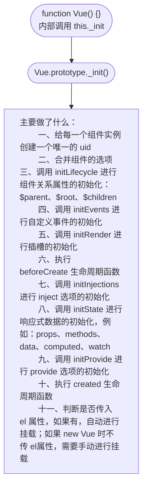
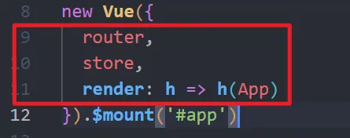
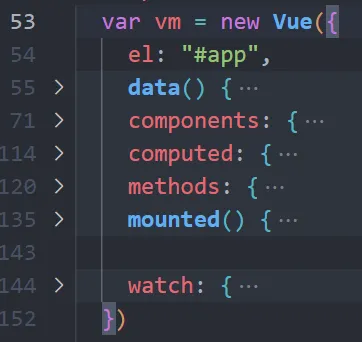
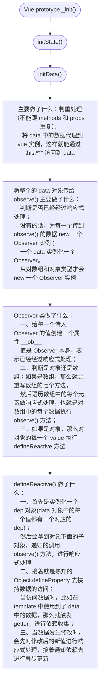
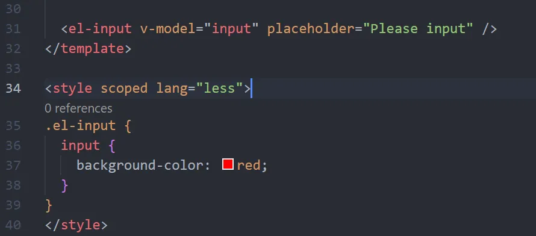
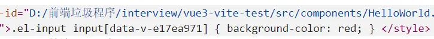
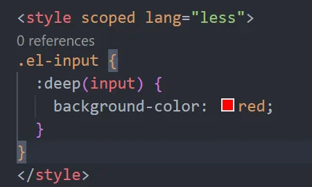
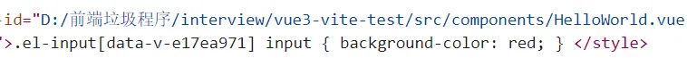

**前言：这一篇涉及到 Vue 的初始化过程、响应式原理、异步更新机制以及一些 API 的原理**
### 一、Vue 的初始化过程做了什么？(new Vue(options) 发生了什么？)

1. 这里合并选项，就是将 new Vue 传入的对象中的自定义选项，跟 Vue 默认的选项进行合并，将合并后的所有选项挂在 vue 实例的 $options 属性上。Vue 默认的属性有：filters(过滤器)、directives(自定义指令)以及 Vue 内置的组件，如： keep-alive 、transition、TransitionGroup。而传入的自定义选项就多种多样了；比如说如下


2. 在第十一点中，vue 的初始化走到最后就是进行挂载，挂载执行的是 vue 实例上的 $mount 方法；在 $mount 方法中又去返回执行 mountComponent() 方法的结果。

### 二、响应式原理
&nbsp;
#### 1、响应式处理的流程图(以 data 选项为例子)

1. 将 data 代理到 vue 上是通过 Object.defineProperty 的方式，也就是将 data 中的每一个数据都放到 vue 实例上；
2. 依赖收集的过程：调用 dep.depend() 方法，将当前的 dep 对象添加到 watcher 实例的数组（这个数组是用来存放 dep 的）中；同时也将 watcher 实例添加到 dep 中，做了一个双向收集；
* 我们知道 dep 收集 watcher 是为了进行通知更新，那 watcher 收集 dep 是为什么？
    >目的是为了能够进行依赖的解除。Watcher 类中有一个方法是 cleanupDeps，作用从 watcher 类的 deps 数组中取出当前不必要的被依赖的 dep，接着是清除掉 dep 对象中无用的 watcher 实例。

    > 假设有这么一种情况：
    首先将 testData 从 true 改成了 false ,然后页面更新.接着修改 message ,如果没有进行依赖清除,那么这时 message 的 dep 对象也会进行通知更新,这是不合理的,因为这个标签已经没必要进行触发更新了,所以就需要依赖清除.

    > 所以这也算是一种性能的优化
```javascript
<div v-if="testData"> {{ message }} </div>
```


3. 当修改了值之后，会触发 Object.defineProperty 的 setter, 在 setter 中会通知依赖，调用 dep.notify() 方法，去遍历 dep 中收集到的所有 watcher 对象，依次去执行他们的 update 方法进行异步更新。
4. 重写数组的七个方法，具体做法是创建一个空对象，然后将七个数组方法名作为键，将名为 mutator 的函数作为七个方法名的值。在 mutator 方法中会先执行原始的数组方法，并将结果保存；比如执行数组的 push 方法，将得到的结果最后返回。如果有新增数据，就对新增的数据进行响应式处理。最后调用 dep.notify() 通知更新。在 Observer 类中，判断数据类型是数组，就将这个包含七个方法的对象放在数组的原型（__proto__）上。
5. Watcher 的类型：
 *   组件 watcher，
 *   computed 的实现也是基于 Watcher
 *   watch 的实现也是基于 Watcher

#### 2、computed 和 watch 的区别
1. computed 是计算属性，通常是对 data 中或者 props 传过来的数据做进一步的处理；computed 具有缓存的效果，也就是说，当依赖的数据没有发生变化，多次调用 computed，computed 中的函数也只会在开头执行一次，不会多次执行。
    * computed 的执行过程是这样的：首先 computed 的实现本质是实例化一个 Watcher，然后通过设置 computed 的属性描述符，修改 get 选项，将其设置为一个 computedGetter() 函数，这个函数内容的主要就是去计算当前 watcher 对象的值，也就是是 computed 的值。等待访问到 computed 时，就会触发 get，来执行上面的操作。
    * computed 能实现缓存的原理：首先上面说到 computed 的本质是 watcher 对象，在实例化 watcher 对象时会传入一个 lazy 属性，值为 true。等到访问 computed ，对应的 watcher 去计算值的时候，会将 watcher 中的另一个名为 dirty 属性置为 false；这样当 computed 在下次再次访问时，判断到 dirty 属性为 false 时，就不会去计算值，而是直接返回值。等到 computed 依赖的值发生了变化，页面发生了更新，watcher 执行 update 方法时，会将 dirty 再次置为 true，等到再次访问 computed 时，就会去计算新值了。
    ``` javascript
    class Watcher {
    lazy: boolean,
    dirty: boolean,
    value: any

    evaluate() {
        this.value = this.get()	// 计算值
        this.dirty = false;
    }

    update() {
        if(this.lazy) {
        this.dirty = true;
        }
    }
    }

    // 当访问到某个 computed 值时，会执行 createComputedGetter() 函数返回的 computedGetter
    // 方法；这个方法内判断 watcher.dirty 属性为 true，然后就去执行 watcher.evaluate() 方法
    // 计算 computed 的值，也将 dirty 属性置为 false；等到再次去访问 computed 时，由于 dirty
    // 为 false，就不会再次进行计算，而是直接返回首次计算的值；
    // 等到页面更新后，执行 watcher.update() 会将 dirty 属性再次置为 true
    ```
2. watch 主要是用来实现当 data、computed、props 中的数据发生变化之后，需要执行的一些回调。本质也是通过实例化 watcher 实现。

### 三、异步更新
&nbsp;
#### 1、数据修改之后是如何进行更新操作的？

```mermaid
flowchart TB
        style B text-align:left;
        style C text-align:left;
        style D text-align:left;
        style D text-align:left;
        style E text-align:left;
        style F text-align:left;
        A(["Object.defineProperty() 的 set 中挟持数据的修改"]) -->
        B["set 中主要做了什么？
        1、判断新值跟旧值是否有变化，如果没有变化，直接返回；
        2、判断是否是只读属性，也就是判断 setter 是否存在，如果不存在，说明是只读属性，直接返回；
        3、对新值进行响应式处理；
        4、调用 dep.notify() 方法，通知收集到的依赖进行更新"] -->
        C["dep.notiyfy() 方法做了什么？
        1、主要就是遍历收集到的 watcher 数组，调用 watcher 的update() 方法，
        去依次执行各自的更新
        "]-->
        D["watcher 的 update() 方法做了什么？
        1、首先是先进行分类：如果是懒执行的 watcher ，那么就将dirty 属性置为 true，
        比如 computed如果是同步执行的 watcher，那么会直接调用 watcher 的 run() 方法进行更新；
        比如 watch 选项，可以配置 async 选项为 true；都不是，那么就进入通常的流程，
        将 watcher 放进一个 watcher 队列中"]-->
        E["watcher 放入队列之后如何处理？
        1、数据发生变化后，要进行更新是通过一个刷新队列的方法，flushSchedulerQueue()。
        这个方法首先会对 watcher 队列中的 watcher 进行排序，
        按照 watcher 实例创建的先后顺序进行排序，然后再依次执行 watcher 的 run() 方法去触发更新；
        2、这个 flushSchedulerQueue() 刷新队列的方法不是直接执行，
        而是放在 nextTick() 中执行；因为 vue 的更新是异步更新。"]-->
        F[" 因此 nextTick() 方法的原理就是 vue 异步更新的核心
        1、首先调用 nextTick() 时，会将传入 nextTick() 的回调函数放入一个 callBakcs 数组中；
        然后有一个 flushCallbacks() 方法来依次遍历数组执行回调；
        2、接着 nextTick() 会通过一个标志位 pending 判断当前的异步任务队列中是否有 flushCallbacks() 方法，
        如果没有，就会调用一个 timeFunc() 方法，将 flushCallbacks() 放进异步任务队列中。
        是放入到微任务队列还是宏任务队列是判断平台支持哪一种。
        如果支持 Promise，优先使用 Promise，然后依次是 MutationObserver、setImmediate、最后是 setTimeout。
        因此是优先考虑微任务，宏任务次之。"]
```

### 四、一些 API 的原理
&nbsp;
#### 1、set 的原理
1. 为什么要有 set？
> 原因是 Vue2 中不能监听到对象中新增属性的变化，以及通过索引给数组新增一个元素（yyx 的说法是处于性能的考虑，因为通过索引来去操作数组对于存储了大量数据的数组来说消耗性能太大），也不能监听其响应式。
2. 用法：Vue.set(obj, key, value) 或者 Vue.set(array, index, value)
3. 原理
> * 首先是判断传入的对象或者数组是否存在，如果不存在，就报警告;
> * 接着判断如果是数组，就调用数组的 slice 方法，进行数组的修改或者新增内容操作；这里调用的 slice 方法是已经被重写后的数组方法；
> * 判断是对象，如果是已经在对象上存在的属性，修改值之后直接返回；
> * 如果是对象新增的值，那么就对新增的值执行 defineReactive() 方法，也就是对新增的值进行响应式处理，然后调 dep.notify() 通知 watcher 进行更新。
#### 2、css 中的 scoped 及 deep 样式穿透原理
1. vue 中 css 的 scoped 原理，主要就是在 DOM 结构以及 css 选择器样式上加上唯一不重复的标记，如：[data-v-hash 值]，以达到样式的私有模块化目的。而如何加上  [data-v-hash 值]，是通过 postcss 中 vue 自行编写的插件实现的。
2. postcss 是什么：
> 是一个解析 css 并创建 ast 的解析器。可以基于 postcss 使用插件对 css 的 ast 进行处理，当处理完成后就可以输出到 css 文件了，而 postcss 本身是不对 css 做额外的特殊处理的。
3. deep 样式穿透：
> 当使用了 scoped 时，如果想修改当前文件下使用的组件中的标签元素样式时，如果直接选择到该标签并修改样式，是不能生效的，如下图：
> 
> **实际编译后的 css 代码选择器:**
> 
> **当使用了 deep 样式穿透之后,也就是将 data-v-hash 向上一级标签移动了:**
> 
> 
> 
4. 具体原理：通过在 postcss 中自行编写的插件实现（等待补充。。。）
#### 3、keep-alive 原理
1. keep-alive 是一个抽象组件，并不会渲染成一个真实的 DOM 元素节点；原因是在定义 keep-alive 组件时，会设置一个 abstract 属性为 true ，在之后调用 initLifecycle() 为父子组件建立关系时，判断到组件的 abstract 属性为 true 就会跳过该组件；
2. 在 keep-alive 组件的 created 中，首先会创建一个 cache 对象，用来存储每一个缓存的组件 Vnode；以及一个 keys 数组，存储缓存组件 Vnode 的 key 值；这个 key 值是由组件的 id 值和 tag 标签名组成的；
3. 其自定义了一个 render() 渲染函数，首先会先拿到 keep-alive 组件插槽的第一个包裹的内容，接着判断是否有传入白名单和黑名单，如果有，那么判断如果白名单中不含该组件名或者黑名单中包含该组件名，那么就直接返回组件的 Vnode，不进行缓存；
4. 接着，就根据当前组件的 id 值和 tag 生成一个 key，根据这个 key 查看 cache 对象中是否已经缓存过当前组件，如果缓存过，那么就拿到缓存过的组件实例，同时更新 keys 数组中对应的 key 值位置；
    * key 值更新具体做法是，先删除掉原有的 key 值所在位置，再将 key 值 push 进 keys 数组中；原因是，如果 keep-alive 设置了最大缓存组件值，即传入了 max 值，那么会采用 LRU 算法，即最近最少使用算法，当所存储的缓存组件达到了上限，那么就删除掉最不常用的缓存组件；
5. 如果当前组件没有缓存过，就在 cache 对象中保存当前需要缓存的组件和对应的 key 值，接着判断是否达到了保存上限，如果是，根据 LRU 算法，删除掉 keys 数组中首位的 key 以及其在 cache 中保存的对应的缓存组件


