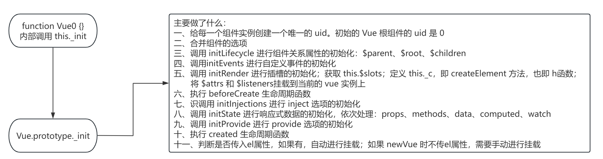
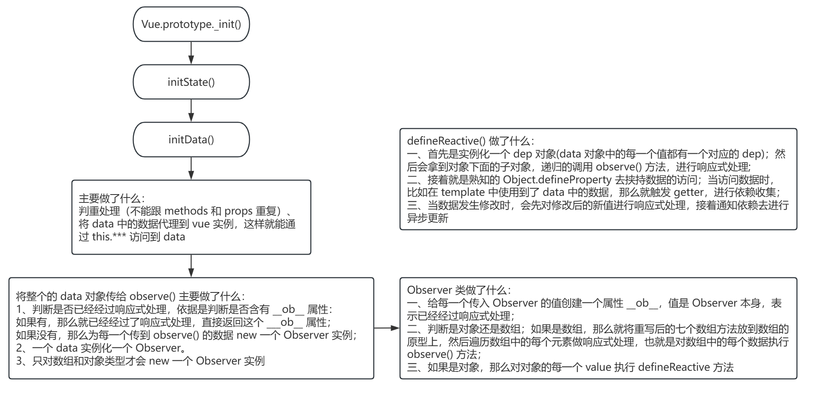
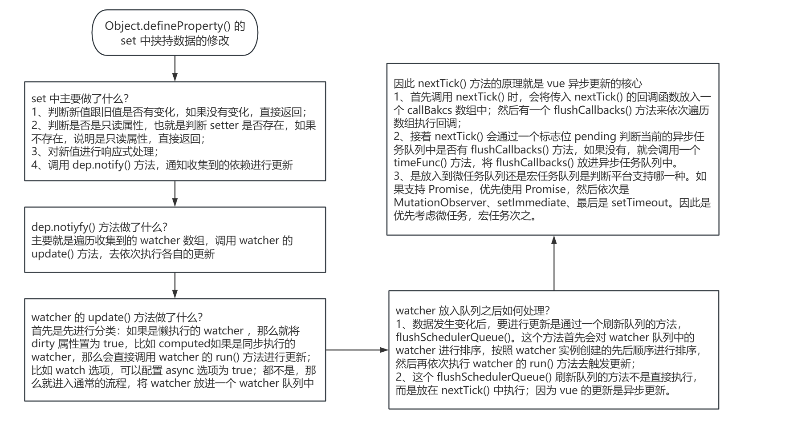

**前言：这一篇涉及到 Vue 的初始化过程、响应式原理、异步更新机制以及一些 API 的原理**
### 一、Vue 的初始化过程做了什么？(new Vue(options) 发生了什么？)

1. 第二点中的合并选项，就是将 new Vue 传入的对象中的自定义选项，跟 Vue 默认的选项进行合并，将合并后的所有选项挂在 vue 实例的 $options 属性上。Vue 默认的属性有：filters(过滤器)、directives(自定义指令)以及 Vue 内置的组件，如： keep-alive 、transition、TransitionGroup。而传入的自定义选项就多种多样了；比如说如下-----


2. 第三点中的处理父子组件关系：当判断到当前组件是抽象组件，即是 `<keep-alive>` 组件时，会跳过对该组件的处理；`<keep-alive>` 是抽象组件，会设置 abstract 属性为 true。
3. 第四点中的初始化自定义事件，事件包括有：
  * 普通的自定义事件，比如父组件通过 @ 绑定在子组件上的
  * 父组件监听子组件的生命周期钩子
  ```js
  // 父组件通过 @ 绑定在子组件上
  <child-component @click="handleClick" @input="handleInput" />
  // 事件的存储形式
  vm._events = {
    click: [handleClick],
    input: [handleInput]
  };

  // 父组件监听子组件的生命周期
  // 会将 vm._hasHookEvent 属性置为 true
  <child-component @hook:mounted="onChildMounted" />
  ```
4. 在初始化 inject 和 provide 时，是先处理 inject 再处理 provide; 这里的原因，个人想法是，当前组件的 inject 用到的 provide 数据，是父组件的 provide, 而当前组件的 provide 是提供给下一个组件的 inject。如果先初始化 provide, 再初始化 inject, 可能会导致当前组件的 provide 数据覆盖父组件的 provide 数据，导致 inject 无法正确获取父组件的数据。
5. 在第十一点中，vue 的初始化走到最后就是进行挂载，挂载执行的是 vue 实例上的 $mount 方法；在 $mount 方法中又去返回执行 mountComponent() 方法的结果。

### 二、响应式原理
#### 1、响应式处理的流程图(以 data 选项为例子)

1. 将 data 代理到 vue 上是通过 Object.defineProperty 的方式，也就是将 data 中的每一个数据都放到 vue 实例上；
```javascript
const sharedPropertyDefinition = {
  enumerable: true,
  configurable: true,
  get: noop,
  set: noop
}

/**
 * 将对象的 key 代理到 vue 实例上；所以才能通过 this.*** 访问到定义在 data/props 中的数据
 * @param target vue 实例
 * @param sourceKey 如果是 props 则传入 '_props'，如果是 data 则传入 '_data'
 * @param key 要代理的 key
 */
function proxy(target: Object, sourceKey: string, key: string) {
  sharedPropertyDefinition.get = function proxyGetter() {
    return this[sourceKey][key]
  }
  sharedPropertyDefinition.set = function proxySetter(val) {
    this[sourceKey][key] = val
  }
  Object.defineProperty(target, key, sharedPropertyDefinition)
}
```
2. 依赖收集的过程：调用 dep.depend() 方法，将当前的 dep 对象添加到 watcher 实例的数组（这个数组是用来存放 dep 的）中；同时也将 watcher 实例添加到 dep 中，做了一个双向收集；
* 我们知道 dep 收集 watcher 是为了进行通知更新，那 watcher 收集 dep 是为什么？
    >目的是为了能够进行依赖的解除。Watcher 类中有一个方法是 cleanupDeps，作用从 watcher 类的 deps 数组中取出当前不必要的被依赖的 dep，接着是清除掉 dep 对象中无用的 watcher 实例。

    > 假设有这么一种情况：
    首先将 testData 从 true 改成了 false ,然后页面更新.接着修改 message ,如果没有进行依赖清除,那么这时 message 的 dep 对象也会进行通知更新,这是不合理的,因为这个标签已经没必要进行触发更新了,所以就需要依赖清除.

    > 所以这也算是一种性能的优化
```javascript
<div v-if="testData"> {{ message }} </div>
```


3. 当修改了值之后，会触发 Object.defineProperty 的 setter, 在 setter 中会通知依赖，调用 dep.notify() 方法，去遍历 dep 中收集到的所有 watcher 对象，依次去执行他们的 update 方法进行异步更新。
4. 重写数组的七个方法，具体做法是基于数组原型创建一个空对象，然后将七个数组方法名作为键，将名为 mutator 的函数作为七个方法名的值。在 mutator 方法中会先执行原始的数组方法，并将结果保存；比如执行数组的 push 方法，将得到的结果最后返回。如果有新增数据，就对新增的数据进行响应式处理。最后调用 dep.notify() 通知更新。在 Observer 类中，判断数据类型是数组，就将这个包含七个方法的对象放在数组的原型（__proto__）上。
```javascript
const arrayProto = Array.prototype  // 拿到 Array 的原型，是一个对象，里面包含着所有数组的方法
const arrayMethods = Object.create(arrayProto) // 基于数组的原型创建一个空对象

// 为什么是这个七个，原因是这七个方法会改变原数组，而其他数组方法都是会返回新数组
const methodsToPatch = ['push','pop','shift','unshift','splice','sort','reverse']

methodsToPatch.forEach(function (method) {
  // cache original method
  const original = arrayProto[method] // 缓存数组中的原始方法
  /**
   * 一开始 arrayMethods 是一个空对象，经过 def, 往里面添加键 为 method，值 为 mutator 函数的键值对
   * 最后的 arrayMethods 结构是：
   * arrayMethods = {
   *  push: ƒ mutator()
   *  pop: ƒ mutator()
   *  shift: ƒ mutator()
   *  unshift: ƒ mutator()
   *  slice: ƒ mutator()
   *  sort: ƒ mutator()
   *  reverse: ƒ mutator()
   * }
   * 所以实际上 mutator 是对原有的数组方法的覆盖，当执行这七个方法时，实际上执行的是对应的 mutator 方法
   */
  def(arrayMethods, method, function mutator(...args) {
    // 这里的 args 参数，就是数组新增的数据
    const result = original.apply(this, args) // 调用原始的数组方法，将结果保存在 result 中
    const ob = this.__ob__  // 获取数组的响应式对象
    let inserted  // 数组新增元素
    switch (method) {
      case 'push':
      case 'unshift':
        inserted = args
        break
      case 'splice':
        inserted = args.slice(2)
        break
    }
    if (inserted) ob.observeArray(inserted) // 对数组新增元素进行响应式处理
    // notify change
    // 通知依赖更新
    if (__DEV__) {
      ob.dep.notify({
        type: TriggerOpTypes.ARRAY_MUTATION,
        target: this,
        key: method
      })
    } else {
      ob.dep.notify()
    }
    return result
  })
})

```


5. Observer 类中的 dep 和 defineReactive() 方法中的 dep 的区别
###### ① Observer 中的 dep
```javascript
const obj = { a: 1 };
const observer=new Observer(obj)；// 对象被观察，observer.dep 被初始化
//如果直接用Vue.set(obj，‘b'，2)，就会触发 observer.dep 通知所有依赖
Vue.set(obj，'b',2)
```
Observer 中的 dep 是针对整个对象的依赖通知，当使用 Vue.set() 给对象新增属性时，这时就会通过对象的 dep 通知依赖更新
###### ② defineReactive 中的 dep
```javascript
const obj = { a: 1 };
defineReactive(obj，"a"，obj.a); // 属性 a 被定义为响应式，a 的 dep 被初始化
//当访问 obj.a 时，会收集依赖到 dep
console.log(obj.a)；／/触发getter，依赖被收集
//当修改obj.a时，会通过dep通知所有依赖
obj.a = 2；//触发setter，依赖被通知更新
```
这里就是针对属性修改的依赖通知，当属性 a 改变时，就通过 defineReactive() 中给对象属性设置的 dep 去通知依赖更新

6. Watcher 的类型：
 *   组件 watcher，
 *   computed 的实现也是基于 Watcher
 *   watch 的实现也是基于 Watcher

#### 2、computed 和 watch 的区别
1. computed 是计算属性，通常是对 data 中或者 props 传过来的数据做进一步的处理；computed 具有缓存的效果，也就是说，当依赖的数据没有发生变化，多次调用 computed，computed 中的函数也只会在开头执行一次，不会多次执行。
    * computed 的执行过程是这样的：首先 computed 的实现本质是实例化一个 Watcher，然后通过设置 computed 的属性描述符，修改 get 选项，将其设置为一个 computedGetter() 函数，这个函数内容的主要就是去计算当前 watcher 对象的值，也就是是 computed 的值。等待访问到 computed 时，就会触发 get，来执行上面的操作。
    * computed 能实现缓存的原理：首先上面说到 computed 的本质是 watcher 对象，在实例化 watcher 对象时会传入一个 lazy 属性，值为 true。等到访问 computed ，对应的 getter 函数(computedGetter)会执行, 该 computed 对应的 watcher 去计算值的时候，会先判断一个 dirty 值(一开始如果传入了 lazy 值为 true 那么 dirty 也被赋值为 true)，如果为 true 那么就会进行计算，也就去执行 watcher.evaluate(), 获取 computed 的值，同时将 dirty 属性置为 false；这样当 computed 在下次再次访问时，判断到 dirty 属性为 false 时，就不会去计算值，而是直接返回值。等到 computed 依赖的值发生了变化，页面发生了更新，watcher 执行 update 方法时，会将 dirty 再次置为 true，等到再次访问 computed 时，就会去计算新值了。
    ``` javascript
    // computed 实现的过程
    export function initState(vm) {
      ...
      if (opts.computed) initComputed(vm, opts.computed)
      ...
    }

    function initComputed(vm, computed) {
      const watchers = (vm._computedWatchers = Object.create(null))
      for (const key in computed) {
        const userDef = computed[key]
        // 判断是函数，直接使用函数；不是函数，那就是对象，去拿到对象中的 get 方法
        const getter = isFunction(userDef) ? userDef : userDef.get

        if (!isSSR) {
          // computed 实现原理：通过 watcher 实现
          watchers[key] = new Watcher(
            vm,
            getter || noop, // 如果 computed 对象中的属性是函数，就将这个函数作为第二个参数传入到 new Watcher 中
            noop,
            lazy: true  // 传入 lazy 标识，是实现缓存的标识。懒执行
          )
        }
        if (!(key in vm)) {
          // 将 computed 对象中的属性(也就是一个个的 computed)代理到 vue 实例上，
          // 这样就可以通过 this.*** 访问到 computed
          defineComputed(vm, key, userDef)
        }
      }
    }
    
    function defineComputed(target, key, userDef) {
      // 这里是进行了简写，源码中做了更细致的处理
      Object.defineProperty(target, key, {
        get: computedGetter() {
          // 拿到当前 key 对应的 watcher
          const watcher = this._computedWatchers && this._computedWatchers[key]
          if (watcher) {
            if (watcher.dirty) {
              /**
              *   evaluate() {
              *      this.value = this.get()  // 获取当前 watcher 对象的值，在 computed 中就是求到该 computed 的值
              *      this.dirty = false
              *   }
              *  可以看到在 evaluate 中，将 dirty 属性设置为了 false；
              *  如果依赖属性没有变化，下一次取值时，是不会执行 watcher.evaluate 的，
              *  而是直接就返回 watcher.value，这样就实现了缓存机制。下面是一个例子
              * 
              *  <template>
              *    <div>{{ computedData1 }}<div/>
              *    <div>{{ computedData2 }}<div/>
              *  <template/>
              * 
              *  这里用了两次的 computedData1，但只有第一次会去执行 computed 中对应的回调函数，计算值，第二个就不会了；
              *  因为在 watcher.evaluate 方法中，会将 dirty 属性置为 false，就不会进这个判断，直接走到下面；
              *  待页面更新后，wathcer.update 方法会将 watcher.dirty 重新置为 true，供下次页面更新时
              *  重新计算 computed.key 的结果
              */
              watcher.evaluate()
            }
            if (Dep.target) {
              if (__DEV__ && Dep.target.onTrack) {
                Dep.target.onTrack({
                  effect: Dep.target,
                  target: this,
                  type: TrackOpTypes.GET,
                  key
                })
              }
              debugger
              watcher.depend()
            }
            return watcher.value
          }
        }
      })
    }
    ```
2. watch 主要是用来实现当 data、computed、props 中的数据发生变化之后，需要执行的一些回调。本质也是通过实例化 watcher 实现。

#### 3、props 和 data
1. 在实现上，在处理 props 时，是通过遍历 props 对象之后，对每一个 props 调用 defineReactive(), 没有调用 observe(); 而对于 data, 在处理时则是传给了 observe(); 个人理解: props 是父组件传给子组件的数据，已经是响应式的了，没有必要再调用 observe() 来递归地处理。
2. 这里又有一个问题，既然已经是响应式了，那么为什么还要调 defineReactive()? 个人理解：是为了将父组件和子组件对于 props 的依赖隔离开，因为当 pops 数据发生变化时，在子组件中也需要有依赖追踪的能力。虽然 props 的值来源于父组件，但父子组件是独立的。即使父组件的响应式系统已经对 props 的值建立了依赖关系，子组件也需要为 props 数据建立自己的依赖关系。

#### 4、Observer Watcher Dep 这三个类的作用
1. Observer: 对对象或者数组类型数据 new 一个 Observer，目的是对数组类型就重写数组上的七个方法以及对数组中的数据进行响应式处理；如果是对象那么就递归的对对象中的数据进行响应式处理。所以总的来说，Observer 类是响应式处理的起点，负责把对象处理成响应式。
2. Watcher: 是观察者，负责执行在 new Watcher 时传入的回调。 Watcher 主要有三种类型.
* 一：是组件的渲染 Watcher 每一个组件，包括根组件在初始化渲染时都会 new 一个 Watcher
* 二：是 Computed
* 三：是用户自定义 Watch
3. Dep: 是一个依赖收集器，也是响应式处理的调度中心。作用就是为响应式数据中的每一项数据收集有哪些 Watcher 使用到了该数据，收集 Watcher, 并在数据变化时去通知到 Watcher 去执行更新


### 三、异步更新

#### 1、数据修改之后是如何进行更新操作的？

### 四、一些 API 的原理

#### 1、set 的原理
1. 为什么要有 set？
> 原因是 Vue2 中不能监听到对象中新增属性的变化，以及通过索引给数组新增、修改一个元素（其实通过 Object.defineproperty 是能够监听到以下标访问数组的 yyx 的说法是处于性能的考虑，因为通过索引来去操作数组对于存储了大量数据的数组来说消耗性能太大），也不能监听其响应式。
2. 用法：Vue.set(obj, key, value) 或者 Vue.set(array, index, value)
3. 原理
> * 首先是判断传入的对象或者数组是否存在，如果不存在，就报警告;
> * 接着判断如果是数组，就调用数组的 slice 方法，进行数组的修改或者新增内容操作；这里调用的 slice 方法是已经被重写后的数组方法；
> * 判断是对象，如果是已经在对象上存在的属性，修改值之后直接返回；
> * 如果是对象新增的值，那么就对新增的值执行 defineReactive() 方法，也就是对新增的值进行响应式处理，然后调 dep.notify() 通知 watcher 进行更新。
#### 2、css 中的 scoped 及 deep 样式穿透原理
1. vue 中 css 的 scoped 原理，主要就是在 DOM 结构以及 css 选择器样式上加上唯一不重复的标记，如：[data-v-hash 值]，以达到样式的私有模块化目的。而如何加上  [data-v-hash 值]，是通过 postcss 中 vue 自行编写的插件实现的。
2. postcss 是什么：
> 是一个解析 css 并创建 ast 的解析器。可以基于 postcss 使用插件对 css 的 ast 进行处理，当处理完成后就可以输出到 css 文件了，而 postcss 本身是不对 css 做额外的特殊处理的。
3. deep 样式穿透：
> 当使用了 scoped 时，如果想修改当前文件下使用的组件中的标签元素样式时，如果直接选择到该标签并修改样式，是不能生效的，如下图：
> 
> **实际编译后的 css 代码选择器:**
> 
> **当使用了 deep 样式穿透之后,也就是将 data-v-hash 向上一级标签移动了:**
> 
> 
> 
4. 具体原理：通过在 postcss 中自行编写的插件实现（等待补充。。。）
#### 3、keep-alive 原理
1. keep-alive 是一个抽象组件，并不会渲染成一个真实的 DOM 元素节点；原因是在定义 keep-alive 组件时，会设置一个 abstract 属性为 true ，在之后调用 initLifecycle() 为父子组件建立关系时，判断到组件的 abstract 属性为 true 就会跳过该组件；
2. 在 keep-alive 组件的 created 中，首先会创建一个 cache 对象，用来存储每一个缓存的组件 Vnode；以及一个 keys 数组，存储缓存组件 Vnode 的 key 值；这个 key 值是由组件的 id 值和 tag 标签名组成的；
3. 其自定义了一个 render() 渲染函数，首先会先拿到 keep-alive 组件插槽的第一个包裹的内容，接着判断是否有传入白名单和黑名单，如果有，那么判断如果白名单中不含该组件名或者黑名单中包含该组件名，那么就直接返回组件的 Vnode，不进行缓存；
4. 接着，就根据当前组件的 id 值和 tag 生成一个 key，根据这个 key 查看 cache 对象中是否已经缓存过当前组件，如果缓存过，那么就拿到缓存过的组件实例，同时更新 keys 数组中对应的 key 值位置，也就是将其 key 值放在数组的最后一位；
    * key 值更新具体做法是，先删除掉原有的 key 值所在位置，再将 key 值 push 进 keys 数组中；原因是，如果 keep-alive 设置了最大缓存组件值，即传入了 max 值，那么会采用 LRU 算法，即最近最少使用算法，当所存储的缓存组件达到了上限，那么就删除掉最不常用的缓存组件；具体做法就是拿到保存 key 值数组的第一位，根据这个 key 去删掉保存缓存 Vnode 对象对应的 Vnode。
    * 这个上限值是用户传入的，如果没有传，那么就没有上限。
5. 如果当前组件没有缓存过，就在 cache 对象中保存当前需要缓存的组件和对应的 key 值，接着判断是否达到了保存上限，如果是，根据 LRU 算法，删除掉 keys 数组中首位的 key 以及其在 cache 中保存的对应的缓存组件


