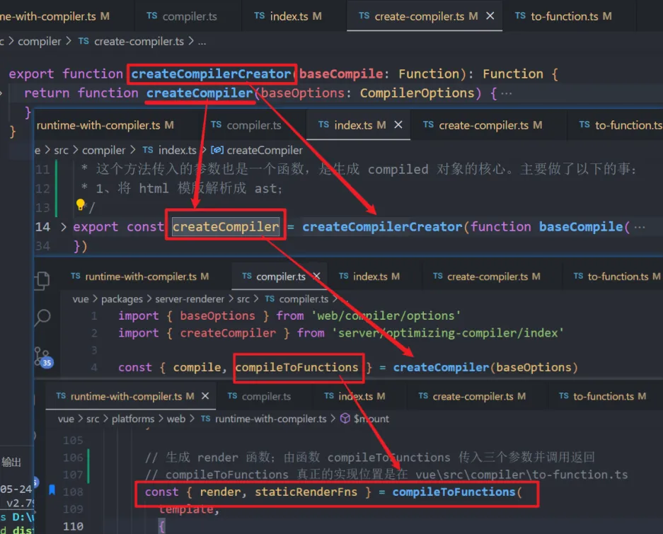
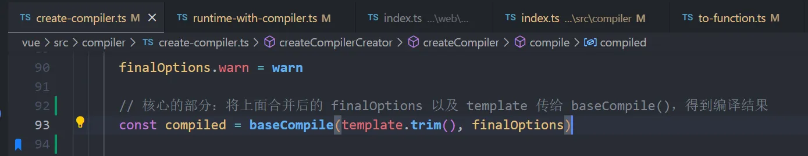

**前言：这一篇涉及到编译器部分，包括 render 函数的生成、挂载过程以及渲染、更新过程**
### 一、编译器——如何生成 render 函数

#### 1、render 函数的两种形式：
1. 用户自己提供，在编写组件时，用 render 选项代替模版；
2. 由编译器编译组件模版生成 render 选项
#### 2、编译器分成三部分
> 分别是：解析、优化、生成渲染函数
* 解析：将类 html 模板转换成 ast；
* 优化：也叫静态标记，遍历 AST 对象，标记每个节点是否为静态节点，以及标记出静态根节点
* 生成渲染函数：将 ast 对象生成渲染函数
整个的流程如下：将 template 模板传给 parse() 函数进行解析生成 ast（抽象语法树）；然后将 ast 传给 generate()，进行处理生成 render() 渲染函数。在调用 generate() 之前，会进行静态标记，将 ast 传给 optimize() ，进行优化。
#### 3、render 函数生成的过程

具体就是由 **compileToFunctions()** 生成 render 和 staticRenderFns；  
由 **createCompiler()** 生成 compileToFunctions()；  
由 **createCompilerCreator()** 生成 createCompiler()；  
在 createCompilerCreator() 函数中可以看到，compileToFunctions() 函数由 **createCompileToFunctionFn()** 函数生成；  
所以重点关注的是 createCompileToFunctionFn() 函数，是如何生成 **compileToFunctions()**，进而生成 render 函数
  * 编译器的核心是一个 compile() 函数，通过将 template 字符串传入，然后生成可执行的 render 字符串；接着将字符串转成函数（就是用 new Function 做一个转换）
  * compile() 函数是核心，作用是生成 render 字符串；而 compile() 内部是去执行一个 baseCompile()，将 template 进行编译；
  
  * 在 baseCompile() 函数中主要分成了三步，分别是将 template 模板生成 ast 抽象语法树；接着进行静态标记；最后生成可执行的静态和动态的 render 函数字符串；
  #### 4、说说如何将 html 字符串模板转换成 ast 的？
  1. 首先是调用 parse() 函数进行解析，在 parse() 中调用 parseHTML() 去处理所有的标签和标签上的属性，开始真正的处理；
  2. 在 parseHTML() 中，不断地循环遍历整个的类 HTML 模板字符串，找到第一个 < 开始的位置，开始处理标签；会定义一个 index 变量，记录当前处理到的字符串索引位置；
  * 首先是注释内容、DOCTYPE 标签，将其剪切掉；
  * 接着就是开始标签，比如 `<div id="#app">` 会得到标签名、 标签内的属性（比如这里属性就是 id="#app"）、标签开始的下标位置，包装成一个对象；
  * 接着会创建当前标签的一个 ast 对象，这个 ast 对象初始的属性包含有：标签名 tag、属性列表数组 attrsList、子节点数组 children 等；后续的处理还会往 ast 对象中添加大量的属性；
  ```javascript
    {
      type: 1, // 标签类型
      tag, // 标签名
      attrsList: attrs, // 属性数组，每一项是个对象，结构如下
      /**
      * [{ name: attrName, value: attrVal, start, end }, ...]
      */
      attrsMap: makeAttrsMap(attrs), // 以属性名为 key, 属性值为 value 生成的对象结构
      rawAttrsMap: {},
      parent,	// 父节点
      children: [], // 子节点元素
  }
  ```
  * 接着对绑定了 v-model 的 input 标签进行处理，这部分处理过程很长，做了很多判断来去处理 input 标签上的属性、指令等等；
  * 处理一些指令比如 v-for、v-if、v-once 等
    * 处理 v-for 指令的结果是得到一个对象 {alisa: "item", for: "vForData"}，将这个对象添加到 ast 中
    * 处理 v-if 指令的结果是将 v-if 后跟的条件判断语句添加到 ast 中；如果是 v-else，在 ast 中添加一个属性名为 else，值为 true；如果是 v-else-if，也是将后面跟的判断语句添加到 ast 中；
    * 处理 v-once 指令是将 once 属性添加到 ast 中，值为 true
  * 开始标签处理完了，接下来就是处理标签包裹的内容了；
  * 等到处理结束标签时，会去遍历 stack 栈中的内容，去找到最近的跟结束标签相同的标签，也就是结束标签对应的开始标签的 ast 对象；找到之后，会去做结束标签的处理，这个处理跟自闭合标签的处理是一样的，调用同一个方法；
  * 如果结束标签没有找到对应的开始标签的 ast 对象，那么就会输出提示警告；
  * 注意：每当处理完一个标签内容，都会将全局的类 HTML 字符串内容中处理过的剪切掉，直到处理完所有内容
#### 5、静态标记
1. 静态标记的作用是什么？
> 目的是性能优化
2. 哪些节点会被标记成静态节点？哪些节点是动态节点？
3. 静态标记的过程
#### 6、从做完了静态标记的 ast 对象到生成最终的 render 函数

### 二、挂载过程
1. 挂载时是调用 vue 实例上的 $mount() 方法；而 $mount() 方法在实例上绑定了两个，第一个是在定义在 src\platforms\web\runtime\index.ts 中，内部直接是返回执行 mountComponent()；第二个则是定义在 src\platforms\web\runtime-with-compiler.ts 中，相当于是是对第一个的重写；目的是在真正挂载前做一个判断，也就是下面部分；而在重写 $mount 之前，用 mount 做了一个保存，在做完判断之后再进行执行。
2. 从第一点中可以知道，在完成初始化之后会调用实例上的 $mount() 方法进行挂载，在挂载之前会先进行一个判断：
    * 一般在使用 Vue 的时候，会选择传入三个选项，分别是 render、template、el，分别是自定义的 render 函数、template 模板字符串和 el 挂载点；如果同时传入这三个选项，那么优先级是 render > template > el；
    * 如果有 render 函数，那么会跳过编译阶段，直接调用 $mount() 方法进行挂载；
    * 如果没有传入 render 函数，那么就接着判断是否有传入 template 选项，如果有就拿到 template 字符串模板去编译生成动态的 render 函数和静态的 render 函数；
    * 如果没有 template 选项，最后去拿到 el 选项，通过 el 选项拿到其绑定到的标签内容，去生成 render 函数；
3. 经过上述的判断之后才会进行挂载；而 $mount() 内部去执行的是 mountComponent() 函数；
4. 在 mountComponent() 中有一个重要的函数 updateComponent()，这个函数是进行组件更新的核心；这个函数就是去执行 vue 实例上的 _render() 方法和 _update() 方法进行页面的渲染和更新的；_render() 方法是负责执行 render 函数来生成 Vnode，将生成的 Vnode 传给 _update()；
5. 同时在 mountComponent() 函数中还会去实例化一个 Watcher 对象，也就是说每一个组件都会对应一个 Watcher；在实例化 Watcher 时会将 updateComponent 函数传入到 Watcher 内部去执行，也就是执行 _update() 函数；
> updateComponent() 函数传入到 Watcher 内部，会赋值给 watcher 的 getter；随后会调用 watcher 中的 get() 方法去执行 getter，也就是传进来的 updateComponent()
### 三、渲染、更新过程
1. 当组件进行挂载的时候会 new 一个对应的渲染 Watcher，将 updateComponent() 传给 Watcher，会在其中被调用执行；而 updateComponent() 函数内就是去执行 vue 实例上的 _update() 方法来对传入的 Vnode 进行渲染更新；
2. 在 _update() 中也会判断下是首次渲染还是进行更新（判断的依据就是当前的 vue 实例上是否存在 Vnode 如果存在，就说明是进行更新；如果不存在则是首次渲染）
3. 进行渲染/更新的核心方法是调用 patch() 方法；patch() 方法接受几个参数，主要的就是两个，旧 Vnode 和新 Vnode；如果传入的旧 Vnode 是真实节点，说明是首次渲染，那么直接给传入的 Vnode 创建节点即可；如果传入的旧 Vnode 和新 Vnode 是同一个节点，说明是进行更新，那么就调用 patchVnode() 进行更新；
4. 所以 patch() 中的两个关键方法是 createElm() 和 patchVnode()
    * createElm() 方法中：首先判断当前的 Vnode 是否是组件，如果是组件，那么就调用创建组件的方法，然后直接返回；如果不是组件，那么就通过原生的 createElement api 创建节点；同时如果有子节点，递归的创建子节点，然后插入到其父节点中；
    * 不是首次渲染，大部分情况都是进入到 patchVnode() 方法中进行节点的更新操作：
      * 首先判断新旧 Vnode 是否是完全相同，如果完全相同，那么没有进行更新，直接返回；相当于是递归调用的出口，因为 patchVnode() 会不断的递归调用；
      * 接着会跳过静态节点的更新；
      * 然后就全量更新 Vnode 上的所有属性，不管有没有变化，都会去遍历一遍进行更新；
      * 接着就判断是不是文本节点，如果是新节点是文本节点，且文本不同就更新文本；
        > a. 不是文本节点，就对子节点进行判断；    
        b. 旧节点没有子节点，新节点有，就创建新的子节点，创建时也是调用 createElm() 方法   
        c. 旧节点有子节点，新节点没有，那么就遍历删除这些子节点；   
        d. 如果新旧子节点都存在，那么就通过 diff 算法来进行处理了；vue2 中的 diff 算法是双端 diff
    * **diff 算法过程**：
      * 首先是定义了四个指针，八个变量；四个指针分别是指向新旧 Vnode 数组的首尾；八个变量是除了四个指针之外，是指针对应的首尾的四个 Vnode；
      * 接着就是循环新旧 Vnode 数组，在循环中做了四个判断，分别是新旧 Vnode 数组的头尾节点对比，如果四个猜想判断命中了，那么就更新该 Vnode 以及移动（需要移动的话）；
      * 如果四个猜想没有命中，那么会根据旧节点数组中 Vnode 的 key 和对应的下标生成 map 结构对象，然后从新节点数组中剩下的没有遍历过的首个节点 Vnode，根据 key 找到 map 中的下标；也就是在旧节点数组中找到新节点的下标，如果找得到下标，就进行 patchNode() 更新，找不到的话说明是新增节点，直接 createElm() 创建新节点；还有一种情况是，找到了 key，但不是同一个节点，说明该节点 key 相同，但以及变了，也当作是新增节点；
        * 一旦命中了四个猜想中的一个，就可以避免一次 while 循环，降低时间复杂度；
      * 循环结束的条件就是新旧 Vnode 两个数组任一个遍历完了；如果新节点数组遍历完了，旧节点数组还有，那么说明旧节点数组中剩下的都是多余的，直接删除就可以了；如果旧节点数组遍历完了，新节点数组还有，那么说明新节点数组剩下的都是新增的，调用 createElem() 创建节点新增
