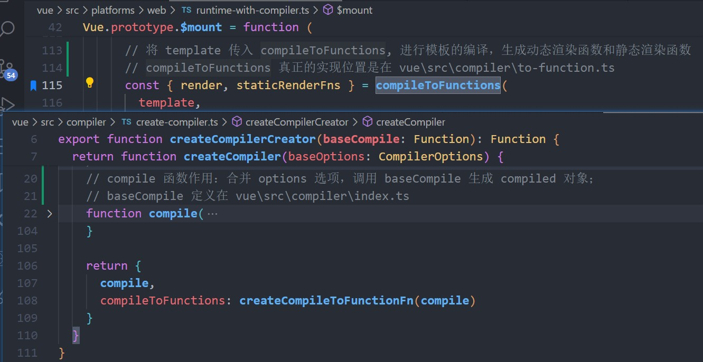

**前言：这一篇涉及到编译器部分，包括 render 函数的生成、挂载过程以及渲染、更新过程**
### 一、编译器——如何生成render函数

#### 1、render 函数的两种形式：
1. 用户自己提供，在编写组件时，用 render 选项代替模版；
2. 由编译器编译组件模版生成 render 选项
#### 2、编译器分成三部分
> 分别是：解析、优化、生成渲染函数
* 解析：将类 html 模板转换成 ast；
* 优化：也叫静态标记，遍历 AST 对象，标记每个节点是否为静态节点，以及标记出静态根节点
* 生成渲染函数：将 ast 对象生成渲染函数
整个的流程如下：将 template 模板传给 parse() 函数进行解析生成 ast（抽象语法树）；然后将 ast 传给 generate()，进行处理生成 render() 渲染函数。在调用 generate() 之前，会进行静态标记，将 ast 传给 optimize() ，进行优化。
#### 3、render 函数生成的过程

具体就是由 **compileToFunctions()** 生成 render 和 staticRenderFns；  
由 **createCompiler()** 生成 compileToFunctions()；  
由 **createCompilerCreator()** 生成 createCompiler()；  
在 createCompilerCreator() 函数中可以看到，compileToFunctions() 函数由 **createCompileToFunctionFn()** 函数生成；  
所以重点关注的是 createCompileToFunctionFn() 函数，是如何生成 **compileToFunctions()**，进而生成 render 函数

  * 编译器的核心是一个 compile() 函数，通过将 template 字符串传入，然后生成可执行的 render 字符串；接着将字符串转成函数（就是用 new Function 做一个转换）
  * compile() 函数是核心，作用是生成 render 字符串；而 compile() 内部是去执行一个 baseCompile()，将 template 进行编译；
  
  * 在 baseCompile() 函数中主要分成了三步，分别是将 template 模板生成 ast 抽象语法树；接着进行静态标记；最后生成可执行的静态和动态的 render 函数字符串；
  ```js
  /**
  * 这个方法传入的参数也是一个函数，是生成 compiled 对象的核心。主要做了以下的事：
  * 1、将 html 模版解析成 ast；
  * 2、对 ast 进行静态标记；
  * 3、将 ast 生成 render 函数
  */
  export const createCompiler = createCompilerCreator(function baseCompile(
    template: string,
    options: CompilerOptions
  ): CompiledResult {
    // 将字符串模板 template 进行解析，生成 ast
    // 每一个组件都会生成一个 ast, 包括根组件和子组件
    const ast = parse(template.trim(), options)
    console.log("生成的 ast 是什么", ast)
    
    if (options.optimize !== false) {
      // 遍历 ast 对每个节点进行判断是否为静态节点，是则进行静态标记
      optimize(ast, options)
    }

    // 代码生成，将 ast 转成可执行的 render 函数的字符串形式
    const code = generate(ast, options)
    return {
      ast,
      render: code.render,  // render 即为动态渲染函数
      staticRenderFns: code.staticRenderFns // 静态渲染函数
    }
  })
  ```
  #### 4、说说如何将 html 字符串模板转换成 ast 的？
  1. 首先是调用 parse() 函数进行解析，在 parse() 中调用 parseHTML() 去处理所有的标签和标签上的属性，开始真正的处理；
  2. 在 parseHTML() 中，不断地循环遍历整个的类 HTML 模板字符串，找到第一个 < 开始的位置，开始处理标签；会定义一个 index 变量，记录当前处理到的字符串索引位置；
  * 首先是注释内容、DOCTYPE 标签，将其剪切掉；
  * 接着就是开始标签，比如 `<div id="#app">` 会得到标签名、 标签内的属性（比如这里属性就是 id="#app"）、标签开始的下标位置，包装成一个对象；
  * 接着会创建当前标签的一个 ast 对象，这个 ast 对象初始的属性包含有：标签名 tag、属性列表数组 attrsList、子节点数组 children 等；后续的处理还会往 ast 对象中添加大量的属性；
  ```javascript
    {
      type: 1, // 标签类型
      tag, // 标签名
      attrsList: attrs, // 属性数组，每一项是个对象，结构如下
      /**
      * [{ name: attrName, value: attrVal, start, end }, ...]
      */
      attrsMap: makeAttrsMap(attrs), // 以属性名为 key, 属性值为 value 生成的对象结构
      rawAttrsMap: {},
      parent,	// 父节点
      children: [], // 子节点元素
  }
  ```
  * 接着对绑定了 v-model 的 input 标签进行处理，这部分处理过程很长，做了很多判断来去处理 input 标签上的属性、指令等等；
  * 处理一些指令比如 v-for、v-if、v-once 等
    * 处理 v-for 指令的结果是得到一个对象 {alisa: "item", for: "vForData"}，将这个对象添加到 ast 中
    * 处理 v-if 指令的结果是将 v-if 后跟的条件判断语句添加到 ast 中；如果是 v-else，在 ast 中添加一个属性名为 else，值为 true；如果是 v-else-if，也是将后面跟的判断语句添加到 ast 中；
    * 处理 v-once 指令是将 once 属性添加到 ast 中，值为 true
  * 开始标签处理完了，接下来就是处理标签包裹的内容了；
  * 等到处理结束标签时，会去遍历 stack 栈中的内容，去找到最近的跟结束标签相同的标签，也就是结束标签对应的开始标签的 ast 对象；找到之后，会去做结束标签的处理，这个处理跟自闭合标签的处理是一样的，调用同一个方法；
  * 如果结束标签没有找到对应的开始标签的 ast 对象，那么就会输出提示警告；
  * 注意：每当处理完一个标签内容，都会将全局的类 HTML 字符串内容中处理过的剪切掉，直到处理完所有内容
#### 5、静态标记
1. 静态标记的作用是什么？
> 目的是性能优化
2. 哪些节点会被标记成静态节点？哪些节点是动态节点？
```javascript
/**
 * 判断传入的节点是否是静态节点
 * @param node 传入的节点
 * @returns 
 * 会被静态标记为 true 的节点：
 * 1、文本节点，没有动态插值表达式；
 * 2、节点上没有 v-bind、v-for、v-if 等指令；
 * 3、非组件节点；
 * 4、不是 <slot></slot>、<component></component>
 * 5、子节点也必须是静态节点
 */
function isStatic(node: ASTNode): boolean {
  /**
   * 这里的 node.type 是 vue 内部定义的：node.type 是2，说明是表达式，则是动态；
   * node.type 是 3，说明是文本节点，则是静态
   */
  if (node.type === 2) {
    // expression
    // 表达式，{{ testData }}
    return false
  }
  if (node.type === 3) {
    // text
    // 文本节点
    return true
  }
  return !!(
    node.pre ||
    (!node.hasBindings && // no dynamic bindings  有动态绑定属性的，是动态节点
      !node.if &&
      !node.for && // not v-if or v-for or v-else  有 v-if、v-for、v-else 的节点，是动态节点
      !isBuiltInTag(node.tag) && // 内置节点，如：<slot></slot>、<component></component>， 是动态节点
      isPlatformReservedTag(node.tag) && // not a component   是组件，那么是动态节点
      !isDirectChildOfTemplateFor(node) &&  // 父节点为含有 v-for 指令的 template 标签，是动态节点
      Object.keys(node).every(isStaticKey))
  )
}
```
3. 静态标记的过程
#### 6、从做完了静态标记的 ast 对象到生成最终的 render 函数
```js
  // baseCompile() 中的
  // 代码生成，将 ast 转成可执行的 render 函数的字符串形式
  const code = generate(ast, options)

  /**
   * 将 ast 生成渲染函数，用 with() 函数包裹
   * @param ast 
   * @param options 
   * @returns 一个对象：
   * {
   *  render: `with(this){return _c(tag, data, children)}`,
   *  staticRenderFns: state.staticRenderFns
   * }
   */
  export function generate(
    ast: ASTElement | void,
    options: CompilerOptions
  ): CodegenResult {
    const state = new CodegenState(options)
    // fix #11483, Root level <script> tags should not be rendered.
    // 生成 code 的形式：'_c(tag, data, children, normalizationType)' 是字符串类型
    const code = ast
      ? ast.tag === 'script'
        ? 'null'
        : genElement(ast, state)
      : '_c("div")'
    return {
      render: `with(this){return ${code}}`,
      staticRenderFns: state.staticRenderFns
    }
  }
```
```js
  /**
   * 
   * @param el 也就是处理过的 ast
   * @param state 
   * @returns code = '_c(tag, data, children, normalizationType)'；children 是一个数组，
   *          包含所有子节点字符串格式的代码
   */
  export function genElement(el: ASTElement, state: CodegenState): string {
    if (el.parent) {
      el.pre = el.pre || el.parent.pre
    }

    if (el.staticRoot && !el.staticProcessed) {
      // 处理静态根节点
      return genStatic(el, state)
    } else if (el.once && !el.onceProcessed) {
      return genOnce(el, state)
    } else if (el.for && !el.forProcessed) {
      return genFor(el, state)
    } else if (el.if && !el.ifProcessed) {
      return genIf(el, state)
    } else if (el.tag === 'template' && !el.slotTarget && !state.pre) {
      return genChildren(el, state) || 'void 0'
    } else if (el.tag === 'slot') {
      return genSlot(el, state)
    } else {
      // component or element
      // 处理动态组件和普通元素，如：自定义组件、原生标签
      let code
      if (el.component) {
        /**
         * 处理动态组件，生成动态组件的渲染函数
         * 得到的 code 是：`_c(compName, data, children)`
         */
        code = genComponent(el.component, el, state)
      } else {
        let data
        // 判断传入的 el 是否是一个组件，是的话，拿到该组件
        const maybeComponent = state.maybeComponent(el)
        if (!el.plain || (el.pre && maybeComponent)) {
          // 非普通元素或者带有 v-pre 指令的组件走这里，处理节点的所有属性，返回一个 JSON 字符串，
          // data = '{ key:xxx, ref:xxx, ...}'
          data = genData(el, state)
        }

        let tag: string | undefined
        // check if this is a component in <script setup>
        const bindings = state.options.bindings
        if (maybeComponent && bindings && bindings.__isScriptSetup !== false) {
          tag = checkBindingType(bindings, el.tag)
        }
        if (!tag) tag = `'${el.tag}'`

        // 处理子节点，得到的 children 是一个数组，包含所有子节点字符串格式的代码
        // children = `['_c(tag, data, children)', ...],normalizationType`，
        const children = el.inlineTemplate ? null : genChildren(el, state, true)

        // 这里得到的 code 的形式是下面这样的：
        // '_c(tag, data, children, normalizationType)'
        code = `_c(${tag}${
          data ? `,${data}` : '' // data
        }${
          children ? `,${children}` : '' // children
        })`
      }
      // module transforms
      // 看起来好像这里的 state.transforms 不存在
      for (let i = 0; i < state.transforms.length; i++) {
        code = state.transforms[i](el, code)
      }
      return code
    }
  }
```

### 二、挂载过程
1. 挂载时是调用 vue 实例上的 $mount() 方法；而 $mount() 方法在实例上绑定了两次，第一个是在定义在 src\platforms\web\runtime\index.ts 中，内部直接是返回执行 mountComponent()；第二个则是定义在 src\platforms\web\runtime-with-compiler.ts 中，相当于是是对第一个的重写；目的是在真正挂载前做一个判断，也就是下面部分；而在重写 $mount 之前，用 mount 做了一个保存，在做完判断之后再进行执行。
2. 从第一点中可以知道，在完成初始化之后会调用实例上的 $mount() 方法进行挂载，在挂载之前会先进行一个判断：
    * 一般在使用 Vue 的时候，会选择传入三个选项，分别是 render、template、el，分别是自定义的 render 函数、template 模板字符串和 el 挂载点；如果同时传入这三个选项，那么优先级是 render > template > el；
    * 如果有 render 函数，那么会跳过编译阶段，直接调用 $mount() 方法进行挂载；
    * 如果没有传入 render 函数，那么就接着判断是否有传入 template 选项，如果有就拿到 template 字符串模板去编译生成动态的 render 函数和静态的 render 函数；
    * 如果没有 template 选项，最后去拿到 el 选项，通过 el 选项拿到其绑定到的标签内容，去生成 render 函数；
```js
// 重写 mount 方法

// 重写前做个保存
const mount = Vue.prototype.$mount

// 初始化走完之后，执行的 mount 就是这里
Vue.prototype.$mount = function (
  el?: string | Element,
  hydrating?: boolean
): Component {
  el = el && query(el)

  // 不能将 el 挂载到 body 或者 html 标签上
  if (el === document.body || el === document.documentElement) {
    __DEV__ &&
      warn(
        `Do not mount Vue to <html> or <body> - mount to normal elements instead.`
      )
    return this
  }

  const options = this.$options
  // resolve template/el and convert to render function
  // 没有提供 render 函数的情况，进入编译阶段;
  // 有 render 函数，跳过编译阶段，直接执行 mount 进行挂载
  // 也就是说，如果用户提供了 render 函数，就跳过编译阶段，否则就进入编译阶段，也就是进入
  // 下面的 if 中(没有 render 选项)
  if (!options.render) {
    let template = options.template
    // template 模板存在的情况，获取 template 的 innerHTML, 也就是 template 包裹的部分
    if (template) {
      if (typeof template === 'string') {
        /**
         * 如果 template 表示是标签 id 的形式：template = "#app"，那么就将 template
         * 转换成该标签的 innerHTML，即是标签包裹的内容
         */
        if (template.charAt(0) === '#') {
          template = idToTemplate(template)
        }
      } else if (template.nodeType) {
        // 如果 template 是正常的节点类型，那么同样拿到节点的包裹的内容
        template = template.innerHTML
      } else {
        return this
      }
    } else if (el) {
      /**
       * 如果是 template 不存在，el 存在的情况下，拿到 el 对应标签的 outerHTML;
       * 一个标签的 outerHTML 指包括该标签以及其包裹的部分；
       * 例如有一个标签 <h3 id="testh3">哈哈哈</h3>，
       * 那么这个标签的 innerHTML 是 "哈哈哈"；
       * outerHTML 是 "<h3 id="testh3">哈哈哈</h3>"
       */
      // @ts-expect-error
      // 这里拿到的 template 是字符串模板，就是 el 挂载节点(包括该节点)包裹的所有标签内容
      template = getOuterHTML(el)
    }
    if (template) {
      // 将 template 传入 compileToFunctions, 进行模板的编译，生成动态渲染函数和静态渲染函数
      // compileToFunctions 真正的实现位置是在 vue\src\compiler\to-function.ts
      const { render, staticRenderFns } = compileToFunctions(
        template,
        {
          outputSourceRange: __DEV__,
          shouldDecodeNewlines,
          shouldDecodeNewlinesForHref,
          delimiters: options.delimiters, // 界定符：默认是 {{}}
          comments: options.comments  // 是否保留注释
        },
        this
      )
      // 这里 options 和 $options 是指向同一个对象，所以也就是相当于给当前的 vue 实例
      // 上赋了 render 和 staticRenderFns
      options.render = render
      options.staticRenderFns = staticRenderFns
    }
  }

  // 执行原来的 mount 进行挂载
  return mount.call(this, el, hydrating)
}

```
3. 经过上述的判断之后才会进行挂载；而 $mount() 内部去执行的是 mountComponent() 函数；
```js
// 原有的 mount 方法
Vue.prototype.$mount = function (
  el?: string | Element,
  hydrating?: boolean
): Component {
  el = el && inBrowser ? query(el) : undefined
  return mountComponent(this, el, hydrating)
}
```
4. 在 mountComponent() 中有一个重要的函数 updateComponent()，这个函数是进行组件更新的核心；这个函数就是去执行 vue 实例上的 _render() 方法和 _update() 方法进行页面的渲染和更新的；_render() 方法是负责执行 render 函数来生成 Vnode，将生成的 Vnode 传给 _update()；
5. 同时在 mountComponent() 函数中还会去实例化一个 Watcher 对象，也就是说每一个组件都会对应一个 Watcher；在实例化 Watcher 时会将 updateComponent 函数传入到 Watcher 内部去执行，也就是执行 _update() 函数；
> updateComponent() 函数传入到 Watcher 内部，会赋值给 watcher 的 getter；随后会调用 watcher 中的 get() 方法去执行 getter，也就是传进来的 updateComponent()
```js
function mountComponent(vm, el, hydrating) {
  // 执行 beforeMount 生命周期函数
  callHook(vm, 'beforeMount');

  let updateComponent
  updateComponent = () => {
    vm._update(vm._render(), hydrating)
  }
  // new 一个 Wacther, 将 updateComponent 传进去
  new Watcher(
    vm,
    updateComponent,
    noop,
    watcherOptions,
    true /* isRenderWatcher */
  )
  // 执行 mounted 生命周期钩子
  if (vm.$vnode == null) {
    vm._isMounted = true
    callHook(vm, 'mounted')
  }
  return vm
}
```
### 三、渲染、更新过程
1. 当组件进行挂载的时候会 new 一个对应的渲染 Watcher，将 updateComponent() 传给 Watcher，会在其中被调用执行；而 updateComponent() 函数内就是去执行 vue 实例上的 _update() 方法来对传入的 Vnode 进行渲染更新；
2. 在 _update() 中也会判断下是首次渲染还是进行更新（判断的依据就是当前的 vue 实例上是否存在 Vnode 如果存在，就说明是进行更新；如果不存在则是首次渲染）
```js
export function lifecycleMixin(Vue: typeof Component) {
  // 进行页面的初始化渲染和后续的页面更新
  Vue.prototype._update = function (vnode: VNode, hydrating?: boolean) {
    const vm: Component = this
    const prevEl = vm.$el
    const prevVnode = vm._vnode // 旧 Vnode
    const restoreActiveInstance = setActiveInstance(vm)
    vm._vnode = vnode // 当前的 Vnode 也就是新 Vnode
    
    // 如果没有 prevVnode, 即是没有旧 vnode，代表首次渲染，即初始化页面
    if (!prevVnode) {
      // 初始化渲染时，传给 patch() 的是真实节点和 Vnode
      vm.$el = vm.__patch__(vm.$el, vnode, hydrating, false /* removeOnly */)
    } else {
      // 不是首次渲染页面，则是进行页面的更新
      vm.$el = vm.__patch__(prevVnode, vnode)
    }
    restoreActiveInstance()
    if (prevEl) {
      prevEl.__vue__ = null
    }
    if (vm.$el) {
      vm.$el.__vue__ = vm
    }
    // if parent is an HOC, update its $el as well
    let wrapper: Component | undefined = vm
    while (
      wrapper &&
      wrapper.$vnode &&
      wrapper.$parent &&
      wrapper.$vnode === wrapper.$parent._vnode
    ) {
      wrapper.$parent.$el = wrapper.$el
      wrapper = wrapper.$parent
    }
    // updated hook is called by the scheduler to ensure that children are
    // updated in a parent's updated hook.
  }

}
```
3. 进行渲染/更新的核心方法是调用 patch() 方法；patch() 方法接受几个参数，主要的就是两个，旧 Vnode 和新 Vnode；如果传入的旧 Vnode 是真实节点，说明是首次渲染，那么直接给传入的 Vnode 创建节点即可；如果传入的旧 Vnode 和新 Vnode 是同一个节点，说明是进行更新，那么就调用 patchVnode() 进行更新；
```js
return function patch(oldVnode, vnode, hydrating, removeOnly) {
  // 新 vnode 不存在，旧 vnode 存在，那么直接销毁旧 vnode
  if (isUndef(vnode)) {
    if (isDef(oldVnode)) invokeDestroyHook(oldVnode)
    return
  }

  let isInitialPatch = false
  const insertedVnodeQueue: any[] = []

  // 老 Vnode 不存在，新 Vnode 存在，说明是组件首次渲染（这里的组件不是根组件首次渲染，应该是子组件）
  // 比如说 <div id="app"><comp-one></comp-one></div>
  // comp-one 首次渲染时，旧 Vnode 不存在，而新 Vnode 存在
  if (isUndef(oldVnode)) {
    // empty mount (likely as component), create new root element
    isInitialPatch = true
    createElm(vnode, insertedVnodeQueue)
  } 
  // 新老节点都存在，说明是进行节点的更新
  else {
    // 判断 oldVnode 是否是真实元素
    // 因为根组件首次渲染时，传给本函数的第一个参数的是真实节点
    const isRealElement = isDef(oldVnode.nodeType)
    if (!isRealElement && sameVnode(oldVnode, vnode)) {
      // patch existing root node
      // 不是真实元素，但新、老节点是同一个节点，说明是更新阶段，执行 patchVnode
      patchVnode(oldVnode, vnode, insertedVnodeQueue, null, null, removeOnly)
    } else {
      // 首次渲染会走这里，因为首次渲染, isRealElement 为 true
      if (isRealElement) {
        // 是真实元素，说明是整个的首次渲染 

        // 基于真实节点创建一个旧 Vnode
        oldVnode = emptyNodeAt(oldVnode)
      }

      // replacing existing element
      // 获取节点的真实元素
      const oldElm = oldVnode.elm
      // 获取节点的父元素节点
      const parentElm = nodeOps.parentNode(oldElm)

      // create new node
      // 到这里，首次渲染创建节点，也就是基于 <div id="app">...</div> 这个 Vnode 开始创建元素了
      createElm(
        vnode,
        insertedVnodeQueue,
        // extremely rare edge case: do not insert if old element is in a
        // leaving transition. Only happens when combining transition +
        // keep-alive + HOCs. (#4590)
        oldElm._leaveCb ? null : parentElm,
        nodeOps.nextSibling(oldElm)
      )

      ...
    }
  }

  invokeInsertHook(vnode, insertedVnodeQueue, isInitialPatch)
  return vnode.elm
}
```
4. 所以 patch() 中的两个关键方法是 createElm() 和 patchVnode()
    * createElm() 方法中：首先判断当前的 Vnode 是否是组件，如果是组件，那么就调用创建组件的方法，然后直接返回；如果不是组件，那么就通过原生的 createElement api 创建节点；同时如果有子节点，递归的创建子节点，然后插入到其父节点中；
    * 不是首次渲染，大部分情况都是进入到 patchVnode() 方法中进行节点的更新操作：
      * 首先判断新旧 Vnode 是否是完全相同，如果完全相同，那么没有进行更新，直接返回；相当于是递归调用的出口，因为 patchVnode() 会不断的递归调用；
      * 接着会跳过静态节点的更新；
      * 然后就全量更新 Vnode 上的所有属性，不管有没有变化，都会去遍历一遍进行更新；
      * 接着就判断是不是文本节点，如果是新节点是文本节点，且文本不同就更新文本；
        > a. 不是文本节点，就对子节点进行判断；    
        b. 旧节点没有子节点，新节点有，就创建新的子节点，创建时也是调用 createElm() 方法   
        c. 旧节点有子节点，新节点没有，那么就遍历删除这些子节点；   
        d. 如果新旧子节点都存在，那么就通过 diff 算法来进行处理了；vue2 中的 diff 算法是双端 diff
### 四、diff算法过程
  * 首先是定义了四个指针，八个变量；四个指针分别是指向新旧 Vnode 数组的首尾；八个变量是除了四个指针之外，是指针对应的首尾的四个 Vnode；
  * 接着就是循环新旧 Vnode 数组，在循环中做了四个判断，分别是新旧 Vnode 数组的头尾节点对比，如果四个猜想判断命中了，那么就更新该 Vnode 以及移动（需要移动的话）；
    * 这里的四个判断分别是：新 Vnode 头和旧 Vnode 头(不需要移动)；新 Vnode 尾和旧 Vnode 尾(不需要移动)；新 Vnode 头和旧 Vnode 尾(需要移动)；新 Vnode 尾和旧 Vnode 尾(需要移动)
  * 如果四个猜想没有命中，那么会根据旧节点数组中 Vnode 的 key 和对应的下标生成 map 结构对象，然后从新节点数组中剩下的没有遍历过的首个节点 Vnode，根据 key 找到 map 中的下标；也就是在旧节点数组中找到新节点的下标，如果找得到下标，就进行 patchNode() 更新，找不到的话说明是新增节点，直接 createElm() 创建新节点；还有一种情况是，找到了 key，但不是同一个节点，说明该节点 key 相同，但以及变了，也当作是新增节点；
    * 一旦命中了四个猜想中的一个，就可以避免一次循环去寻找当前的新节点对应在旧节点数组中的位置，降低时间复杂度；
  * 循环结束的条件就是新旧 Vnode 两个数组任一个遍历完了；如果新节点数组遍历完了，旧节点数组还有，那么说明旧节点数组中剩下的都是多余的，直接删除就可以了；如果旧节点数组遍历完了，新节点数组还有，那么说明新节点数组剩下的都是新增的，调用 createElem() 创建节点新增

**以下是各种 diff 情况的说明**：
```text
第一种情况：
旧 vnode [a, b, c, d, e]
新 vnode [e, d, c, b, a]

第一轮：
旧 vnode 的头(a)跟新 vnode 的头(e)比较，key 不同；
旧 vnode 的尾(e)跟新 vnode 的尾(a)比较，key 不同；
旧 vnode 的头(a)跟新 vnode 的尾(a)比较，key 相同，然后执行 patchNode() 进行节点的更新，然后移动节点，
将旧节点 a 对应的真实节点，移动到旧节点 e 对应真实节点的下一个兄弟节点的前面，此时的 DOM 结构
[b, c, d, e, a]；
然后旧 vnode 的指针往后移动，新 vnode 往前移动

第二轮：
旧 vnode 的头(b)跟新 vnode 的头(e)比较，key 不同；
旧 vnode 的尾(e)跟新 vnode 的尾(b)比较，key 不同；
旧 vnode 的头(b)跟新 vnode 的尾(b)比较，key 相同，然后执行 patchNode() 进行节点的更新，然后移动节点，
将旧节点 b 对应的真实节点，移动到旧节点 e 对应真实节点的下一个兄弟节点的前面，此时的 DOM 结构
[c, d, e, b, a]；

第三轮一样，形成的 DOM 结构 [d, e, c, b, a]

第四轮一样，形成的 DOM 结构 [e, d, c, b, a]

第五轮：
此时旧 vnode 的指针指向了 e，新 vnode 的指针也指向了 e，然后是头跟头比较，key 相同，执行 patchNode() 进行
节点的更新，不同移动，完成了 diff 的过程。

第二种情况：
旧 vnode [a, b, c, d, e]
新 vnode [d, c, g, h, f]

第一轮：
经过四次头尾比较之后，没有找到相同的 vnode，此时的 oldStartIdx 指向 0；那么就从新 vnode 的头节点
(其实就是新 vnode 中剩下未处理的节点)开始找在旧 vnode 中有没有对应的节点 vnode，发现有 d，接着记录
d 对应的下标 index，然后执行 patchNode()。接着就是移动节点，将找到的旧 vnode 中的 d 节点对应的真实
DOM 移动到 oldStartIdx 指向的旧节点的前面，此时的 DOM 结构
[d, a, b, c, e]
然后移动 newStartIdx，指向 1

第二轮：
继续进行四次的头尾比较（旧的头(a)尾(e)，新的头(c)尾(f)），没有找到相同的 vnode，和上面的一样，
在旧 vnode 中找到了 c，然后执行 patchNode()，接着移动节点，还是移动到 oldStartIdx 指向的节点的前一个节点，
此时的 DOM 结构
[d, c, a, b, e]
然后移动 newStartIdx，指向 2

第三轮：
继续进行四次的头尾比较（旧的头(a)尾(e)，新的头(g)尾(f)），没有找到相同的 vnode，此时在旧 vnode 中找 g 的时候，
发现旧 vnode 中没有 g 说明是新增节点，那么就创建 DOM 节点，然后插入到 oldStartIdx 指向的节点的前一个节点，
此时的 DOM 结构
[d, c, g, a, b, e]
然后移动 newStartIdx，指向 3

第四轮：
跟第三轮一样，h 是新增的，所以创建 DOM，插入到 oldStartIdx 指向的节点的前一个节点，此时的 DOM 结构
[d, c, g, h, a, b, e]
然后移动 newStartIdx，指向 4

第五轮：
跟第四轮一样，f 是新增的，所以创建 DOM，插入到 oldStartIdx 指向的节点的前一个节点，此时的 DOM 结构
[d, c, g, h, f, a, b, e]
然后移动 newStartIdx，指向 5

此时 newStartIdx 已经越界了，接着判断到旧 vnode 还有剩余节点 [a, b, e]；为什么剩余的旧 vnode 数组是 [a, b, e]？
因为每一次在旧 vnode 数组中找到了新 vnode 的节点并执行 patchNode() 后，会将其对应在旧 vnode 数组中的置为
undefined: oldCh[idxInOld] = undefined


```
