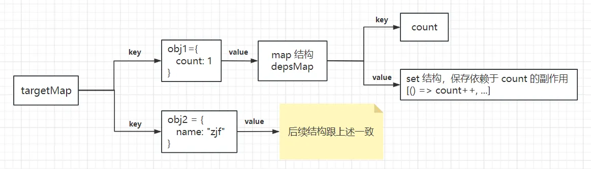
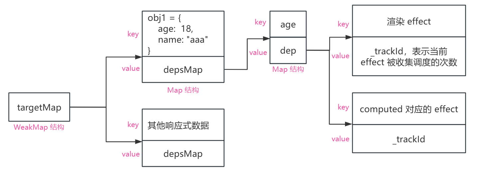
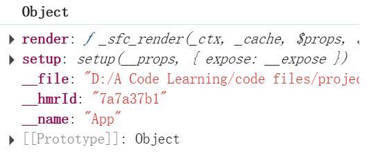

### 一、响应式原理

#### 1、reactive 原理
1. 内部是返回一个 createReactiveObject() 方法；在这个方法内部会经过一系列的判断，比如：判断传进来的对象是否已经响应式处理过了；筛选出能够被代理的对象；判断在 proxyMap 这个 Map 中是否有缓存过的对象；最后通过筛选的对象进行 new Proxy()。
2. 在 new Proxy() 中会传入 get、set 这两个主要的拦截处理函数；get 是调用 createGetter() 方法生成；set 是调用 createSetter() 方法生成。
3. 在 get 中就是进行依赖的收集。跟 vue2 不同的是，vue3 中当 get 被触发时，会调用 track() 方法来进行依赖收集。首先是通过构造一个全局的 WeakMap 对象来进行数据的处理的；这个 WeakMap 对象为 targetMap。targetMap 的 key 是传入 reactive() 的对象，也就是需要响应式处理的对象(称为 obj)；value 是一个 map 对象，为 depsMap，以 obj 对象每一个属性为 key，而 value 是一个 set 集合结构，保存的是依赖对应属性的副作用（比如说 obj 中有一个属性为 count，有一个副作用函数将 obj.count++，那么 set 就是用来保存所有依赖 count 的副作用）。当 obj 的属性被访问的时候，就会收集到所有的依赖。
```js
get(target, key, receiver) {
    ...
    const res = Reflect.get(target, key, receiver);
    // 调用 track 进行依赖收集
    if (!isReadonly) {
      track(target, TrackOpTypes.GET, key)
    }
    ...
    return res
}
function track(target, type, key) {
  if (shouldTrack && activeEffect) {
    // 取出当前 target 对应的 map
    let depsMap = targetMap.get(target)
    // 不存在，创建一个新的
    if (!depsMap) {
      targetMap.set(target, (depsMap = new Map()))
    }
    // vue3.4 之后将 dep 也改成了 map 结构
    let dep = depsMap.get(key)
    if (!dep) {
      depsMap.set(key, (dep = createDep(() => depsMap!.delete(key))))
    }
    // activeEffect 表示当前正在执行的 effect
    trackEffect(activeEffect, dep)
  }
}
function trackEffect(effect, dep, debuggerEventExtraInfo) {
  /**
   * 这一步的判断是看当前的 effect 是否被重复收集了;
   * _trackId 表示 effect 中的副作用函数执行的次数，因为在执行 effect 中的副作用函数时，
   * effect 的 _trackId 都会加一；这个操作是在访问响应式数据时就发生了，因为渲染 effect 在 new ReactiveEffect() 时，
   * effect 中的 run() 就会执行一次，传给渲染 effect 的 componentUpdateFn 执行，effect 的 _trackId 加一
   * 如果相等，说明这个 effect 在本轮的收集中已经被追踪了，不需要再次收集，直接跳过
   */
  if (dep.get(effect) !== effect._trackId) {
    dep.set(effect, effect._trackId)
    const oldDep = effect.deps[effect._depsLength]
    if (oldDep !== dep) {
      if (oldDep) {
        cleanupDepEffect(oldDep, effect)
      }
      effect.deps[effect._depsLength++] = dep
    } else {
      effect._depsLength++
    }
    if (__DEV__) {
      // eslint-disable-next-line no-restricted-syntax
      effect.onTrack?.(extend({ effect }, debuggerEventExtraInfo!))
    }
  }
}
```

4. 上面的 targetMap 的结构是 vue3.4 前的，vue3.4 之后将 depsMap 这个 map 结构中的 value 也改成了 map 结构，不再是 set，同时在 effect 中引入了一个 _trackId，表示当前 effect 被调度收集的次数，也表示 effect 中的副作用函数被执行的次数。这个 _trackId 很重要，因为在进行依赖收集时，会判断当前要收集的 effect 即 activeEffect 是否已经在本轮已经被收集过了，判断的依据就是 effect 上的 _trackId。
> 比如下面的例子，首先将标签的内容编译成 render 函数，然后执行 render 函数，第一次访问到 obj1.age，触发 age 的 getter，执行到 trackEffect，这时 age 对应的 dep 这个 map 结构，还没有存储有 effect，所以 dep.get(effect) 是 undefined。而此时的渲染 effect 的 _trackId 是 1，因此会进入到判断，将此时的渲染 effect 收集到 age 对应的 dep 结构中。

> 等到第二次访问 obj1.age，还是走一遍上面的流程，但此时 age 对应的 dep 中已经收集有渲染 effect 了，所以此时的判断 dep.get(effect) !== effect._trackId 就为 false(因为此时判断到两个 _trackId 是相等的)，就不会进入判断，所以就不会在本轮收集中重复收集 effect
```js
<div>{{obj1.age}}</div>
<div>{{obj1.age}}</div>
<div>{{obj1.name}}</div>

let obj1 = reactive({
    name: "aaa",
    age: 18
})

let com = computed(() => {
    testDataObj1.age + 1
})

```
响应式数据对应的结构

5. 当 obj 中的属性发生改变时，也就是触发到 set，那么会调用 trigger() 方法，首先去拿到被修改属性的 dep 的 key 值，也就是被修改数据的对应的 effect；接着调用 triggerEffects，将这些对应的 effect 的 scheduler() 方法放进 queueEffectSchedulers 队列中，然后是依次执行 effect 的 scheduler 方法；而这个 scheduler 方法是在生成渲染 effect 时，传入的第三个参数，(如下面)即 () => queueJob(update)。执行 scheduler 方法就是去执行 queueJob(update)，也就是将 update 放进执行队列中；而 update 就是去重新执行 componentUpdateFn。

在 queueJob 这个方法中，就是去异步执行队列中的副作用函数，将对应的函数传到 Promise.then().resolve() 中，放进微队列去执行。
```js
// 创建响应式 effect 用于渲染
const effect = (instance.effect = new ReactiveEffect(
    componentUpdateFn,
    NOOP,
    () => queueJob(update), // 调用 queueJob 将 update 放进更新队列
    instance.scope, // track it in component's effect scope
))

// 另外两种 effect 的初始化

// computed 对应的 effect
class ComputedRefImpl {
  constructor() {
    this.effect = new ReactiveEffect(
      () => getter(this._value),
      () =>
        triggerRefValue(
          this,
          this.effect._dirtyLevel === DirtyLevels.MaybeDirty_ComputedSideEffect
            ? DirtyLevels.MaybeDirty_ComputedSideEffect
            : DirtyLevels.MaybeDirty,
        ),
    )
    this.effect.computed = this
    this.effect.active = this._cacheable = !isSSR
    this[ReactiveFlags.IS_READONLY] = isReadonly
  }
}

// watch 对应的 effect
let scheduler: EffectScheduler
if (flush === 'sync') {
  // sync 同步执行，表示在进行任何更新之前执行
  scheduler = job as any // the scheduler function gets called directly
} else if (flush === 'post') {
  // post 表示在 DOM 更新之后执行
  scheduler = () => queuePostRenderEffect(job, instance && instance.suspense)
} else {
  // default: 'pre'
  // 默认情况下：父组件更新之后，当前组件的 DOM 更新之前执行
  job.pre = true
  if (instance) job.id = instance.uid
  scheduler = () => queueJob(job)
}

const effect = new ReactiveEffect(getter, NOOP, scheduler)

// 三种 effect 在实例化时，传给 ReactiveEffect 的参数的情况：渲染 effect 跟 watch effect 传递的第二个参数是空函数；
// computed effect 则是没有传递第三个参数
```
#### 2、ref 原理
1. 因为 reactive 针对的是对象类型数据的响应式处理，而对于原始值，如 Number、undefine、String、Boolean、Symbol、BigInt、null，reactive 的实现本质 proxy 就不能处理了；所以针对原始值类型，提出 ref 来处理；
2. 当使用 ref() 时，会调用 createRef() 创建一个 RefImpl 类的实例，所以经过 ref() 处理过得到的值本质上就是一个对象，是 RefImpl 类的实例对象；
3. 而 RefImpl 类中定义了名为 value 的 get 和 set 的拦截操作；这也就是为什么使用 ref 定义的响应式数据需要 .value；假设 let a = ref(0) 当使用 a.value 时，就会触发 a 对象上的 get() ，首先是调用 trackEffects 进行依赖收集，然后就返回值；等到设置值时，就触发 set 调用 triggerEffects 去通知所有依赖进行修改.
```js
function ref(value?: unknown) {
  return createRef(value, false)
}
function createRef(rawValue: unknown, shallow: boolean) {
  if (isRef(rawValue)) {
    return rawValue
  }
  return new RefImpl(rawValue, shallow)
}
class RefImpl<T> {
  private _value: T
  private _rawValue: T

  public dep?: Dep = undefined
  public readonly __v_isRef = true

  constructor(
    value: T,
    public readonly __v_isShallow: boolean,
  ) {
    this._rawValue = __v_isShallow ? value : toRaw(value)
    this._value = __v_isShallow ? value : toReactive(value)
  }
  // 获取当前值时，调用 trackRefValue 进行依赖收集
  get value() {
    trackRefValue(this)
    return this._value
  }
  // 修改当前值时， 调用 triggerRefValue 去通知依赖更新
  set value(newVal) {
    if (hasChanged(newVal, this._rawValue)) {
      const oldVal = this._rawValue
      this._rawValue = newVal
      this._value = toReactive(newVal)
      triggerRefValue(this, DirtyLevels.Dirty, newVal, oldVal)
    }
  }
}
```
#### 3、ReactiveEffect 类的作用
1. ReactiveEffect 类在 Vue3 的响应式系统中是一个重要的类，可以理解成是 Vue2 中的 Watcher 类；把 ReactiveEffect 类的实例称为 effect;
2. ReactiveEffect 类实例化主要是在三个地方，分别是：
    *   在 render 时实例化的 effect，称为渲染 effect
    *   在实现 computed 中实例化的 effect
    *   在实现 watch 中实例化的 effect
3. 先着重看下响应式系统中如何结合 ReactiveEffect 类进行副作用函数的收集和触发的
    *   在 render 过程中，会 new ReactiveEffect 创建 effect 实例，同时将组件更新的方法传到 ReactiveEffect 类中，在后续中会将这个组件更新的副作用函数进行收集；一个组件就会创建一个渲染 effect；
    *   同时在 new ReactiveEffect 类时，会将 componentUpdateFn() 函数，也就是负责组件的挂载和更新的函数传到类的内部；在 ReactiveEffect 类中有一个 run() 方法，会将 run() 方法赋值给 Vue 实例上一个 update 属性，接着执行 update() 方法，也就是去执行类的 run() 方法；
    *   run() 会拿到负责组件挂载和更新的函数，并执行它，开始了组件的挂载/更新；同时会将一个全局的变量 activeEffect 赋值为当前的渲染 effect；
    *   接着会执行传入到 ReactiveEffect 类的 componentUpdateFn() 方法，进行组件的挂载，在这个方法中会执行 render 函数去生成 Vnode，在这个时候就会访问到响应式数据，触发了 get，进而触发依赖收集；而这里的依赖收集，就是收集当前正在被激活的 effect，就是 activeEffect，也就是当前的渲染 effect；等到响应式数据被修改时就会触发 set，执行 trigger()，去遍历 dep 中所有的 effect，触发他们的更新
### 二、初始化创建过程

#### 1、调用 createApp(App).mount('#app') 发生了什么
1. 在 createApp() 方法实现中，会先执行 ensureRenderer() 这个函数，返回一个对象，这个对象中包含一个跟 createApp() 同名的方法，通过 createApp() 来创建 app 对象；而 createApp() 又是通过 createAppAPI() 方法生成，这个方法还接受了 render 函数作为参数；
```javascript
export const createApp = ((...args) => {
    // ensureRenderer 方法返回的是一个对象，里面包含 crateApp() 方法；
    // 而 createApp() 这个方法是通过 createAppAPI() 返回的
    const app = ensureRenderer().createApp(...args)
    if (__DEV__) {
        // 检查是否是原生标签
        injectNativeTagCheck(app)
        // 检查是否是自定义标签
        injectCompilerOptionsCheck(app)
    }
    // 对 app 中的 mount 作一个缓存
    const { mount } = app

  /**
   * 定义 mount 挂载方法，重写 app.mount() 方法，目的是支持跨平台渲染；
   * 实际用户调用的 mount 就是这个 mount 方法
   * @param containerOrSelector 要挂载的节点
   * @returns 
   */
    app.mount = (containerOrSelector: Element | ShadowRoot | string): any => {}
})
```
2. 在 createAppAPI() 这个方法中主要就是创建 app 对象，在这个对象上挂载了许多属性和方法；属性有 _uid、_component、_props、_container、_context、_instance；而方法中有一个主要的 mount() 方法，也就是在后续进行挂载时会被调用。
```javascript
/**
 * 创建 app 实例。上面挂载了许多属性和方法；
 * 方法：use、mixin、component、directive、mount、unmount、provide、runWithContext
 */
const app = (context.app = {
    _uid: uid++,  // app 实例的唯一标识
    _component: rootComponent as ConcreteComponent, // 根组件
    _props: rootProps,  // 根组件的 props
    _container: null, // 根组件的容器，挂载点
    _context: context,  // app 上下文
    _instance: null,  // 根组件实例

    version,

    // 获取 app 的上下文，只能获取不能设置修改
    get config() {
        return context.config
    },

    set config() {
        if(_DEV_) warn(`app.config cannot be replaced. Modify individual options instead.`,)
    },

    use() {},
    mixin() {},
    component() {},
    directiv() {},
    mount() {},
    unmount() {},
    provide() {},
    runWithconte() {}
})
```

### 三、调用 mount 进行挂载
#### 1、挂载过程
1. 在 mount() 中，首先会通过 createVNode() 方法创建 Vnode，接着就将 Vnode 传给 render()，进行渲染;
```javascript
// 重写 mount 方法
const { mount } = app
app.mount = (containerOrSelector) => {
    const container = normalizeContainer(containerOrSelector)
    if (!container) return

    const component = app._component

    // clear content before mounting
    // 挂载前清空容器内容
    container.innerHTML = ''

    // 这里的 mount 就是上面从 app 解构出来的
    const proxy = mount(container, false, resolveRootNamespace(container))

    // 移除 v-vloak 属性；添加 data-v-app 容器节点表示已经挂载
    if (container instanceof Element) {
      container.removeAttribute('v-cloak')
      container.setAttribute('data-v-app', '')
    }
    return proxy
}

```
```javascript
mount(
    rootContainer: HostElement,
    isHydrate?: boolean,
    namespace?: boolean | ElementNamespace,
    ): any {
    if (!isMounted) {
        // 这里调用 createNode 创建 vnode
        const vnode = createVNode(rootComponent, rootProps)
        vnode.appContext = context

        if (namespace === true) {
            namespace = 'svg'
        } else if (namespace === false) {
            namespace = undefined
        }

        // HMR root reload
        if (__DEV__) {
            context.reload = () => {
                // 这里调用 render 函数进行渲染
                render(cloneVNode(vnode), rootContainer, namespace as ElementNamespace,)
            }
        }

        if (isHydrate && hydrate) {
            hydrate(vnode as VNode<Node, Element>, rootContainer as any)
        } else {
            render(vnode, rootContainer, namespace)
        }

        // isMounted 设置为 true
        isMounted = true

        // app 对象上设置 _container 属性
        app._container = rootContainer

        // for devtools and telemetry
        ;(rootContainer as any).__vue_app__ = app

        if (__DEV__ || __FEATURE_PROD_DEVTOOLS__) {
            app._instance = vnode.component
            devtoolsInitApp(app, version)
        }

        return getComponentPublicInstance(vnode.component!)
    }
},
```
> vue3 中重写 mount() 方法的原因，个人理解的原因是：
> * 这里跟 Vue2 源码一样，原有的 mount() 方法是通用的标准渲染方式，因为 Vue 设计的理念就是能够各平台通用，所以原有的 mount() 方法就是通用的渲染流程，不包含任何的平台逻辑和规范：也就是先创建 Vnode 再渲染 Vnode。而重写的 mount() 方法就是针对于 Web 平台的。当然，重写后的 mount() 方法也会调用原来的 mount() 方法。 
> * 职责分明、模块清晰；原有的 mount 方法负责将组件挂载到 DOM 容器中，处理组件的渲染和更新逻辑。在之前的一些额外的处理和检查，如容器标准化、模板处理和清空容器内容等，放在这里处理，更符合职责分明的原则。
> * 便于维护，如果后续有其他的处理逻辑，可以直接在这里添加，不需要修改原有的 mount 方法。
2. createVNode() 方法创建 vnode。
```javascript
const createVNode = (__DEV__ ? createVNodeWithArgsTransform : _createVNode)

function _createVNode() {
    /** 省去对传入 createBaseVNode() 参数的处理*/
    ...
    // 创建 vnode
    return createBaseVNode(
        type,
        props,  // 表示传递给该节点的属性或配置对象
        children,
        patchFlag,  // 表示节点的动态部分
        dynamicProps,
        shapeFlag,
        isBlockNode,  // 表示该节点是否是一个 Block 节点
        true,
    )
}

// vnode 中的具体属性
const vnode = {
    __v_isVNode: true,
    __v_skip: true,
    type,
    props,
    key: props && normalizeKey(props),
    ref: props && normalizeRef(props),
    scopeId: currentScopeId,
    slotScopeIds: null,
    children,
    component: null,
    suspense: null,
    ssContent: null,
    ssFallback: null,
    dirs: null,
    transition: null,
    el: null,
    anchor: null,
    target: null,
    targetStart: null,
    targetAnchor: null,
    staticCount: 0,
    shapeFlag,
    patchFlag,
    dynamicProps,
    dynamicChildren: null,
    appContext: null,
    ctx: currentRenderingInstance,
}
```
3. 在调用 createVNode() 创建 Vnode 时传入的 rootComponent, 在工程化项目(通过 webpack 或 vite 处理)中，会被编译器进行处理(如果是 webpack 是通过 vue-loader; 如果是 vite 则是内部的插件)。因为在工程化的 vue 项目中，一般都是如下的方式使用:
```javascript
import App from './App.vue';
const app = createApp(App);
app.mount('#app');
```
那么这里传给 createApp() 的 App 组件，就会被编译器转化为下面的形式:

也就是一个包含 render() 和 setup() 的对象，这个对象也就是 createVNode(rootComponent) 中的 rootComponent。在上面的 createBaseVNode() 中创建的 vnode 对象，会将 rootComponent 对象，赋值给 vnode 中的 type 属性，后续在 patch() 中进一步处理时，就会从 vnode 的 type 属性中取出 setup 函数和 render 函数去执行处理。

4. 在 render() 中主要的，就是调用 patch() 进行；patch() 方法接受多个参数，主要的就是头两个，旧 Vnode 和新 Vnode；如果旧 Vnode 不存在，传了新 Vnode 说明就是初次渲染挂载；如果新旧 Vnode 都存在，说明是进行更新；
```javascript
const render: RootRenderFunction = (vnode, container, namespace) => {
// 如果 vnode 为 null，且 container._vnode 存在，则进行卸载操作
if (vnode == null) {
    if (container._vnode) {
        unmount(container._vnode, null, null, true)
    }
} else {
    patch(
        container._vnode || null,
        vnode,
        container,
        null,
        null,
        null,
        namespace,
    )
}
    container._vnode = vnode
    if (!isFlushing) {
        isFlushing = true
        flushPreFlushCbs()
        flushPostFlushCbs()
        isFlushing = false
    }
}
```
#### 2、patch 过程和 diff 算法
1. 在 patch() 中会针对新 Vnode 的不同类型进行不同的处理，比如说文本节点、静态节点、普通的标签元素、组件、vue 内置组件，如：teleport、suspense 等；
2. 如果新旧两个节点完全相同，那么就不用处理，直接 return；如果新旧两个节点不是同一个节点（节点类型或者 key 有一个不同）那么就卸载旧节点；
```javascript
const patch = function() {
    // 新旧节点相同，直接返回
    if (n1 === n2) {
        return
    }
    // 新旧节点类型不同，卸载旧节点
    if (n1 && !isSameVNodeType(n1, n2)) {
      anchor = getNextHostNode(n1)
      unmount(n1, parentComponent, parentSuspense, true)
      n1 = null
    }
    ...
}
```

3. 接着判断节点类型，根据不同的节点类型，做不同的处理。
```javascript
    const { type, ref, shapeFlag } = n2
    // 判断节点类型
    switch (type) {
      case Text:  // 文本节点
        processText(n1, n2, container, anchor)
        break
      case Comment: // 注释节点
        processCommentNode(n1, n2, container, anchor)
        break
      case Static:  // 静态节点
        if (n1 == null) {
          mountStaticNode(n2, container, anchor, namespace)
        } else if (__DEV__) {
          patchStaticNode(n1, n2, container, namespace)
        }
        break
      case Fragment:  // Fragment 节点
        processFragment()
        break
      default:
        if (shapeFlag & ShapeFlags.ELEMENT) { // 元素节点
          processElement()
        } else if (shapeFlag & ShapeFlags.COMPONENT) {
          // 如果是首次渲染，也即根组件，或者是组件类型，比如子组件，则走这里
          processComponent()
        } else if (shapeFlag & ShapeFlags.TELEPORT) {
          ;(type as typeof TeleportImpl).process()
        } else if (__FEATURE_SUSPENSE__ && shapeFlag & ShapeFlags.SUSPENSE) {
          ;(type as typeof SuspenseImpl).process()
        } else if (__DEV__) {
          warn('Invalid VNode type:', type, `(${typeof type})`)
        }
    }
```

* 如果是文本节点、注释节点、静态节点、Fragment 节点一次调用对应的方法进行处理；
* 如果是普通的 HTML 元素就调用 processElement() 进行挂载更新
    * 如果旧 Vnode 不存在，那么就直接进行挂载；
    * 如果新旧 Vnode 都存在，那么就调用 patchElement() 进行更新；在 patchElement() 中主要的部分就是调用 patchChildren() 通过 diff 算法进行比较处理更新；
      * 如果含有 key 的话，就是进行全量 diff；调用 patchKeyedChildren()；分成了五步进行处理；
          > 
          ```javascript
          /**
           * c1: 旧节点 VNode 数组
            * c2: 新节点 VNode 数组
            */
          const patchKeyedChildren = (c1, c2) {
              let i = 0 // 新节点的起始索引
              const l2 = c2.length  // 新节点的长度
              let e1 = c1.length - 1 // prev ending index  旧节点的结束索引
              let e2 = l2 - 1 // next ending index  新节点的结束索引
              ...
          }
          ```
          > * 首先分别从新旧 Vnode 数组的开头同时开始向后遍历，如果遇到同一个节点，就进行 patch()；如果没有遇到就跳过，继续判断下一对；
          ```javascript
          while (i <= e1 && i <= e2) {
              const n1 = c1[i]
              const n2 = c2[i]
              if (isSameVNodeType(n1, n2)) {
                  patch()
              } else {
                  break
              }
              i++
          }
          ```
          > * 接着从新旧 Vnode 数组的结尾开始向前遍历，如果遇到同一个节点，就进行 patch()；如果没有遇到就跳过，继续判断下一对；
          ```javascript
          while (i <= e1 && i <= e2) {
              const n1 = c1[e1]
              const n2 = c2[e2]
              if (isSameVNodeType(n1, n2)) {
                  patch()
              } else {
                  break
              }
              e1--
              e2--
          }
          ```
          > * 经过上面两轮循环之后，进行判断，如果新节点数组还有剩余而旧节点数组已经遍历完了，说明新节点数组剩下的都是新增节点，进行新增；
          ```javascript
          if (i > e1) {
              if (i <= e2) {
                  const nextPos = e2 + 1
                  const anchor = nextPos < l2 ? (c2[nextPos] as VNode).el : parentAnchor
                  while (i <= e2) {
                      patch()
                      i++
                  }
              }
          }
          ```
          > * 接着判断，经过两轮循环之后如果旧节点数组还有剩余而新节点数组已经遍历完了，说明旧节点数组剩下的都是没用的，直接删除；
          ```javascript
          else if (i > e2) {
              while (i <= e1) {
                  unmount(c1[i], parentComponent, parentSuspense, true)
                  i++
              }   
          }
          ```
          > * 还有一种情况是，经过两轮遍历之后，新旧 Vnode 数组都有剩余，那么对剩余新旧节点进行处理；
          > 遵循的原则是，尽可能多地复用原节点，尽可能少地移动节点。
          
          > 这里举个例子：旧 VNode 是 a b [c d e] f g, 新 VNode 是 a b [e c d h] f g; 在经过上面地处理之后，头尾的 a b f g 已经被
          patch 了。对于中间部分的 c d e 需要被更新成 e c d h; 按照常规思路是 c 更新成 e; d 更新成 c; e 更新成 d; 然后新增 h, 总共需要四个步骤。

          >但其实可以这样考虑, c 和 d 不用移动，将 e 移动到 c 前面，然后新增 h, 这样只需要两个步骤。这就是 vue3 中 diff 的优化思路：找出新节点数组中，在旧节点数组对应的索引构成的最长递增子序列。

          > 在上面的例子中，由数组 [5, 3, 4, 0] 最终生成的最长递增子序列的数组是 [1, 2] 也就是在旧节点数组中剩余的未处理节点的第一个和第二个是不需要移动的。

          > 生成最长递增子序列的算法思路是：贪心 + 二分查找 + 链表的回溯
          ```javascript
          /**
          * 求得数组的最长递增子序列。主要思路是：贪心 + 二分查找 + 链表的回溯修正
          * 1、贪心：比如说当前求得的递增子序列是 [2, 4, 7] 然后下一个遍历到的值是 6
          * 6 比 7 要小，肯定不能直接放在序列后面，那么就考虑是以 [2, 4, 7] 为基础构成最长递增子序列的潜力大还是
          * 以 [2, 4, 6] 为基础构成的最长递增子序列潜力大，那么肯定是 [2, 4, 6] 所以这就是贪心；
          * 2、二分：当遍历到的数比当前子序列最后一位小，那么就在已经构成的子序列中寻找一个比当前数大的，去替换掉；而寻找的
          * 思路，就是二分，因为子序列是有序的，在有序的数组中寻找某一个数，效率最高的是二分
          * 3、链表的回溯修正：因为上面的替换，所以最终形成的子序列的位置，跟原来数组的位置肯定已经变了，所以需要进行修正
          * @param arr 传入的是 新节点数组 中 剩余未处理节点 在 旧节点数组 中的索引数组
          * @returns 返回的是传入的索引数组的最大递增子序列对应数组的索引数组
          */
          function getSequence(arr: number[]): number[] {
              const p = arr.slice() // 构造反向链表，用于最后对生成的最长递增子序列进行修正
              const result = [0]  // 存储的是最后要返回的结果数组，保存的是最长递增子序列在 arr 中的索引值
              /**
              * i: 遍历 arr 数组的索引值
              * j: 每次 j 取到的值都是 result 的最后一位，也就是最长递增子序列最后一位数在 arr 中的索引值；
              * 那么 result[j] 取到的就是索引值, arr[j] 取到的就是目前得到的递增子序列的最后一位数
              * u: 二分查找的起始值
              * v: 二分查找的末尾值
              * c: 二分查找的中点值
              */
              let i, j, u, v, c
              const len = arr.length
              for (i = 0; i < len; i++) {
                  const arrI = arr[i]
                  // 这里为 0 就不做处理，因为如果是 0 ，说明 0 对应位置的节点是新节点，在旧节点数组中找不到
                  if (arrI !== 0) {
                      j = result[result.length - 1] // 取出 result 数组中的最后一位，也就是索引值
                      // 如果 arrI 比结果序列中的最后一位大,说明找到了可以形成递增序列的数
                      if (arr[j] < arrI) {
                          // 这里将 p 中的 i 位置的内容指向了和 arrI 构成递增序列的它前面的数的索引值,也就是 j
                          // [10, 30, 100, 200, 300, 50, 60] 这是传进来的 arr
                          // 那么当遍历到 arrI = 30 时, arr[j] 是 10; 因此 p[i] = j 也就是 p[1] = 0
                          // 这时的 p : [10, 0, 100, 200, 300, 50, 60]
                          // arrI = 100, p = [10, 0, 1, 200, 300, 50, 60]
                          // arrI = 200, p = [10, 0, 1, 2, 300, 50, 60]
                          // arrI = 300, p = [10, 0, 1, 2, 3, 50, 60], result = [0, 1, 2, 3, 4]
                          p[i] = j
                          result.push(i)
                          continue
                      }

                      // 二分查找开始，寻找到在第 i 项之前的数形成的递增序列数组中的所有数中第一个比第 i 项大的数，来替换它
                      /**
                      * 为什么要二分查找？
                      * 因为这里用到的思想是贪心，也就是说，要寻求最长递增子序列，那么就是要求序列中的每一位都要
                      * 尽可能的小；当经过上面的判断，当前遍历到的 arr 数组中的第 i 项数不能接在之前构成的递增子
                      * 序列后，所以就在之前构成的递增子序列中找到第一个比它大的数，并替换掉
                      * 
                      */
                      u = 0 // 指向首位的指针
                      v = result.length - 1 // 指向末位的指针

                      // 等到跳出 while 循环之后，得到的 u 值就是寻找到的递增序列中第一个比 arrI 
                      // 大的数对应的在 arr 中的索引
                      while (u < v) {
                          c = (u + v) >> 1  // 取中点
                          if (arr[result[c]] < arrI) {
                              // arrI 比遍历到的数大，说明当前遍历到的数太小，左指针要在中点的左边
                              u = c + 1
                          } else {
                              // arrI 比遍历到的数小，说明当前遍历到的数太大，右指针改成中点位置
                              v = c
                          }
                      }
                      // 经过上面的循环，找到递增序列中第一个比 arrI 大的数；
                      // 因为 result 存储的就是递增序列在 arr 中的索引，所以 arr[result[x]] 取到的就是 arr 中的递增序列

                      // 这时 arrI = 50, 找到的 u 是 arr 中 100 的索引值是 2; arr = [10, 30, 100, 200, 300, 50, 60]
                      // 经过下面的 p[i] = result[u - 1], 即 p[5] = result[2 - 1]; result = [0, 1, 2, 3, 4]

                      // arrI = 50, p = [10, 0, 1, 2, 3, 1, 60], result = [0, 1, 5, 3, 4]
                      // arrI = 60, p = [10, 0, 1, 2, 3, 1, 5],  result = [0, 1, 5, 6, 4]
                      if (arrI < arr[result[u]]) {
                          if (u > 0) {
                              p[i] = result[u - 1]
                          }
                          // 找到了之后，因为贪心的思想，result 中存储的索引对应的数应该是尽可能的小，
                          // 所以就将 result 中原来存储的索引替换成当前遍历到的 arr 中的数的索引值
                          result[u] = i
                      }
                  }
              }

              // 这一部分是回溯修正
              // 因为根据上面的二分 + 贪心的处理，得到的 result 是 [0, 1, 5, 6, 4], 对应形成的最长递增序列
              // 是 10 30 50 60 300 但是在数组中的顺序却是不正确的，因此需要修正
              u = result.length
              v = result[u - 1]
              while (u-- > 0) {
                  result[u] = v
                  v = p[v]  // p 数组保存的是 
              }
              return result
          }
          ```