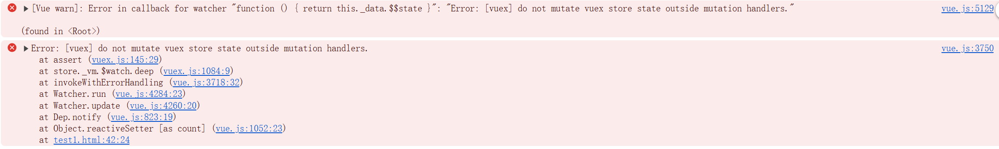

**本篇浅谈一下 VueX 原理**
### 一、初始化过程
1. 在使用 vueX 插件时，主要就是两个步骤，一个是 Vue.use()，进行插件的安装。当进行 Vue.use() 时，会去执行插件对象的 install() 方法；另一个就是 store 对象的初始化。在这两个步骤中，vueX 在 4.* 版本和 3.* 版本是不同的；
    * 4.* 版本：在执行 install() 中，是通过 app.config.globalProperties 这个 Vue3 的 api 注册能够被应用内所有组件实例访问到的全局属性的对象，即 $store 属性
    * 3.* 版本：在使用 store 时，是通过 new Vuex.Store({}), 所以在实现上是有一个 Store 类。
      ```js
      export class Store {
        constructor(options = {}) {}
        get() {}
        set() {}
        commit() {}
        dispatch() {}
        ...
      }
      ```

      在执行 install() 中，则是通过 Vue.mixin() 向所有的组件注入 beforeCreate() 钩子生命周期执行时的初始化操作，将 store 对象绑定给每一个的组件，使得每一个组件能够通过 this.$store 拿到 store 对象；
    
    在 mixin 混入的这段逻辑中，还判断了下是否是 Vue 的根组件，因为在使用 vueX 时，是将 store 实例传给了根组件，所以判断如果是根组件的话，直接将根组件选项上的 store 赋给 $store 即可；如果不是根组件，而是子组件的话，那么就访问其父组件，将其父组件的 $store 实例赋给子组件。因为 Vue 在创建父子组件时，是先创建父再创建子。
### 二、各选项的实现
#### 1、state 的实现
为了实现 state 中的数据也是响应式的，通过将 state 中的数据传给 new Vue() 中的 data 选项，将得到的 Vue 实例赋值给 store 中的 vm 属性，接着通过 class 类中的 get 属性访问器，在获取 state 时，返回 vm 属性上的 data 数据，也就是 Vue 实例中的 data 数据，经过这样就可以实现 state 选项中的数据响应式；
```js
export class Store {
  constructor(options = {}) {
    ...
    // 处理 state 中的数据，使其具有响应式
    resetStoreVM(this, state)
  }
  // 获取 state 时，返回经过响应式处理的 state
  get state () {
    return this._vm._data.$$state
  }
}


function resetStoreVM (store, state, hot) {
  ...
  const silent = Vue.config.silent
  Vue.config.silent = true

  // 将 state 中的数据进行响应式处理
  store._vm = new Vue({
    data: {
      $$state: state
    },
    computed
  })
  Vue.config.silent = silent
}
```
#### 2、getters 的实现
主要是通过 Object.defineProperty 和 computed 实现的。在 store 实例中创建一个 getters 空对象，然后通过 Object.defineProperty 向 getters 空对象赋值，key 是用户传入的每一个 getter 名，value 则是通过设置 get 进行拦截，当获取 getter 时，会返回对应 getter 函数执行的结果；
* 为了实现 getter 的缓存效果，也就是只有 getter 依赖的 state 数据发生了改变，对应的 getter 函数才会重新执行，将每一个 getter 存进了 computed，利用 computed 的缓存属性，也实现了 getters 的缓存
```js
store._wrappedGetters = Object.create(null)

function resetStoreVM (store, state, hot) {
  // 这里的 getters 保存的是使用 getters 时拿的每一个 getter 属性
  store.getters = {}
  // reset local getters cache
  store._makeLocalGettersCache = Object.create(null)
  const wrappedGetters = store._wrappedGetters
  const computed = {}
  forEachValue(wrappedGetters, (fn, key) => {
    // 这里的 fn 就是一个个的 getter
    // key 是 getter 的名称

    // 同时注意，这里用到了 computed 来实现缓存，也就是只有 getters 依赖的 state 中的值发生
    // 了变化，对应的 getters 函数才会重新执行
    // computed[key] = function() { return fn(store) }
    // computed[key] = function() { return getter(store) }
    computed[key] = partial(fn, store)

    // 通过 Object.defineProperty 往用户使用的 getters 对象中添加每一个 getter 作为 key;
    // 在获取值是通过 get 去劫持，来执行传入的 getters() 方法；
    // 从而实现定义的是函数而获取时直接取值即可
    Object.defineProperty(store.getters, key, {
      // new Vue 时传入的 computed methods 都会被放到 new Vue() 得到的实例中，所以这里可以直接
      // 通过 store._vm[key] 拿到 computed 中的内容
      get: () => store._vm[key],
      enumerable: true // for local getters
    })
  })
}
store._vm = new Vue({
  ...
  computed
})
```
#### 3、mutations 和 actions 的实现
这两者的实现都是基于发布订阅实现的，思路都是将用户传入的 mutation 和 action 放进数组中，等到执行对应的 mutation 和 action 时再去遍历执行数组中对应的函数。      
这里用到了一个很巧妙的思路，就是在处理 mutations、actions 时，都是将其放进数组中处理，目的是为了处理，各个模块使用了同样的 mutation 名且没有设置 namespaced 为 true 时，当调用 commit 触发 mutation，同名的会被依次触发；而如果在模块中设置了 namespaced 为 true，那么在存储时，数组对应的 key 值会带上模块的模块名，这样在使用 commit 调用时，如果不加上对应的模块名，也就不会调用到其他模块的 mutation。
```js
function installModule(store, rootState, path, module, hot) {
  ...
  const local = module.context = makeLocalContext(store, namespace, path)
  /**
   * mutation 是具体的函数方法
   * key 是 mutation 名称
   * namespace 是拼接起来的模块名称 "moduleA/moduleB/moduleC/"
   */
  module.forEachMutation((mutation, key) => {
    const namespacedType = namespace + key
    registerMutation(store, namespacedType, mutation, local)
  })
}
/**
 * 将每一个 mutation 存到 store._mutations 这个对象中
 * 每一个同名的 mutation 放到一个数组中
 * 为什么要用一个数组来保存 mutation 中的函数呢？原因是：
 * 当不同模块间使用了同名的 mutation 时，由于是采用数组存储，因此会将不同模块间同名的
 * mutation 收集起来，等到触发时会依次触发。所以是为了应对这种场景
 * 
 * 以上的情况是没有使用命名空间 namespaced 设置为 true 的情况，如果 namespaced 设置了
 * true 那么 _mutations 对象中存储 mutation 的数组的 key 值就会加上当前模块的名称，
 * 这样就是一个新的数组了，也就不会一起被触发
 * @param {*} store 
 * @param {*} type mutations 名称，如果当前模块设置了 namespaced 为 true, 那么该 mutation 
 * 名称前面会加上所处模块的模块名称。如：moduleA/mutationName
 * @param {*} handler 
 * @param {*} local
 * 
 * 最后放在 store 实例中的 mutations 的结构如下：
 * store = {
 *    _mutations: {
 *        moduleA/mutationName: [fn]
 *    }
 * }
 */
function registerMutation (store, type, handler, local) {
  const entry = store._mutations[type] || (store._mutations[type] = [])
  entry.push(function wrappedMutationHandler (payload) {
    handler.call(store, local.state, payload)
  })
}
```
#### 4、module 的实例化注册过程
``` javascript
class Store {
  this._modules = new ModuleCollection(options)
}

// ModuleCollection 类用于管理整个的 store
// 将用户传入的 options 转成一个树结构
class ModuleCollection {
  constructor(rawRootModules) {
    this.register([], rawRootModules)
  }

  register(path, rawModule) {
    const module = new Module(rawModule)

    // 首次注册的话会给当前实例上挂载一个 root 属性，表示根模块
    this.root = module

    // 不是首次注册的话，将当前模块添加到其父级模块的 _children 属性下
    // 因为下面会对模块的子模块进行递归的注册
    parent.addChild(path[path.length - 1], newModule)

    // 如果当前模块包含子模块，那么会递归的进行注册
    if (rawModule.modules) {
      forEachValue(rawModule.modules, (rawChildModule, key) => {
        this.register(path.concat(key), rawChildModule, runtime)
      })
    }
  }
}

// 用于将 store 中的每一个模块转成实例，管理每一个模块的内容
class Module {
  constructor(rawModule) {
    this._children = {}
    this._rawModule = rawModule
    this.state = rawModule.state
  }
}
```
#### 5、commit 的实现原理
commit 的核心就是去遍历存储 mutation 的数组，然后执行数组中的方法；但是为了处理一些情况将这个过程了做了一些包装处理。比如说，不能在 commit 中使用异步的方式来修改 state，即使用这种方式是不合规的 commit。为了处理这种情况，做法是这样的：
* 定义了一个变量 _committing，初始化值为 false 表示的是当前的 commit 操作是否是合规的；然后将遍历执行存储 mutation 数组中的方法的过程包装成一个 fn() 函数，将这个函数传给了一个方法 _withCommit()，在这个方法中去执行；在这个方法中，执行 fn() 前，会先将 _committing 置为 true，接着执行 fn() ，也就是 mutation 去修改 state 中的状态，执行完之后再将 _committing 置为 false。
```js
export class Store {
  ...
  commit(_type, _payload, _options) {
    ...
    // 拿到保存了 mutations 的数组
    const entry = this._mutations[type]

    /**
     * 将执行 mutation 的过程放在这个函数中，在这个函数的执行过程是这样的：
     * const committing = this._committing
     * this._committing = true
     * fn()
     * this._committing = committing
     * 初始的时候 this._committing 为 false, 在执行 mutation 修改 state 之前设置为 true，也就是说只有放进
     * _withCommit 这个函数去执行的 fn 才是被允许的去修改 state 状态的操作，在 state 中的状态被修改时 _committing
     * 的值是 true，被修改完之后，被改成了 false；因此在使用 Vue.$watch 去监听 state 中数据变化时，就可以判断
     * _committing 的值是否为 true，是 true 说明是被允许的修改 state 的操作，如果为 false 说明是不被允许的操作，
     * 报错。
     * mutation 中使用异步操作也一样，因为 Vue.$watch 去监听 state 中数据变化时，设置了 immediate 为 true，因此
     * 如果在 mutation 中为异步，那么在执行完 mutation 也就是传入到 _withCommit 中的 fn, _committing 的值已经被
     * 改成了 false, 等到 state 中的数据被修改时, Vue.$watch 监听, _committing 的值为 false, 就会报错
     */
    this._withCommit(() => {
      // 遍历存储了 mutation 的数组，依次去执行里面的函数
      entry.forEach(function commitIterator (handler) {
        handler(payload)
      })
    })
    ...
  }
}
```
* 而在 store 进行初始化时，会通过 Vue.$watch 去监听 state 中数据的变化，如果 state 中的数据发生变化时，_committing 的值为 false，那说明是不合规的进行了状态修改，报错；假如是通过异步的方式去修改 state，那么在 _withCommit() 中执行完了 fn() 但此时 state 状态并没有修改，因为是异步操作修改，等到真正修改时，此时的 _committing 已经为 false 了，所以就报错。
```js
function resetStoreVM(store, state, hot) {
  ...
  // 严格模式下，只能用 mutation 去修改 state 中的值且 mutation 中不能做异步操作
  if (store.strict) {
    enableStrictMode(store)
  }
}

/**
 * 严格模式下会调用这个方法；
 * 利用 Vue.$watch 监听 state 的状态是否发生了变化，如果发生了变化，那么就立即执行回调；
 * 这个回调用了一个 console.assert() 方法，当判断第一个传入的表达式为 false 时，会输出第二个参数信息
 * @param {*} store 
 */
function enableStrictMode (store) {
  store._vm.$watch(function () { return this._data.$$state }, () => {
    if (__DEV__) {
      assert(store._committing, `do not mutate vuex store state outside mutation handlers.`)
    }
  }, { deep: true, sync: true })
}
```
报错信息如下

#### 6、dispatch 的实现原理
1. dispatch 的实现原理和 commit 的实现原理类似，都是遍历存储 actions 的数组，然后执行数组中的方法。但是 dispatch 的实现原理比 commit 的实现原理复杂一些，因为 actions 中可以包含异步操作，因此 dispatch 的实现原理中，会处理一些异步操作的情况。
```js
/**
 * 拿到每一个 action 并进行存储
 * action 是具体的函数方法
 * key 是 action 名称
 */
module.forEachAction((action, key) => {
  const type = action.root ? key : namespace + key
  const handler = action.handler || action
  registerAction(store, type, handler, local)
})

/**
 * 将每一个 action 放进数组中，等待 dispatch 调用执行，
 * 并且将每一个 action 执行之后的结果包装成一个 Promise(如果结果已经是 Promise 那么就直接返回)
 */
function registerAction (store, type, handler, local) {
  const entry = store._actions[type] || (store._actions[type] = [])
  entry.push(function wrappedActionHandler (payload) {
    let res = handler.call(store, {
      // 省略大量参数。。。
    }, payload)
    if (!isPromise(res)) {
      res = Promise.resolve(res)
    }
    return res
  })
}
/**
 * 遍历 actions 数组中的方法然后依次执行，返回一个 Promise
 * @param {*} _type 
 * @param {*} _payload 
 * @returns 
 */
dispatch (_type, _payload) {
  const { type,payload } = unifyObjectStyle(_type, _payload)

  const action = { type, payload }
  const entry = this._actions[type]
  ...
  // 如果需要执行的 action 数量超过一个，那么就将 action 放到 Promise.all 中执行
  const result = entry.length > 1
    ? Promise.all(entry.map(handler => handler(payload)))
    : entry[0](payload)

  return new Promise((resolve, reject) => {
    result.then(res => {
      resolve(res)
    }, error => {
      reject(error)
    })
  })
}
```
