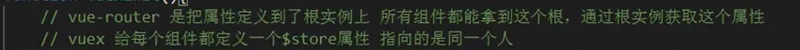

**本篇浅谈一下 VueX 原理**
### 一、初始化过程
1. 在使用 vueX 插件时，主要就是两个步骤，一个是 Vue.use()，进行插件的安装。当进行 Vue.use() 时，会去执行插件对象的 install() 方法；另一个就是 store 对象的初始化。在这两个步骤中，vueX 在 4.* 版本和 3.* 版本是不同的；
    * 4.* 版本：在执行 install() 中，是通过 app.config.globalProperties 这个 Vue3 的 api 注册能够被应用内所有组件实例访问到的全局属性的对象，即 $store 属性
    * 3.* 版本：在执行 install() 中，则是通过 Vue.mixin() 向所有的组件注入 beforeCreate() 钩子生命周期执行时的初始化操作，将 store 对象绑定给每一个的组件，使得每一个组件能够通过 this.$store 拿到 store 对象；
    
    在 mixin 混入的这段逻辑中，还判断了下是否是 Vue 的根组件，因为在使用 vueX 时，是将 store 实例传给了根组件，所以判断如果是根组件的话，直接将根组件选项上的 store 赋给 $store 即可；如果不是根组件，而是子组件的话，那么就访问其父组件，将其父组件的 $store 实例赋给子组件。因为 Vue 在创建父子组件时，是先创建父再创建子。
### 二、各选项的实现
#### 1、state 的实现
为了实现 state 中的数据也是响应式的，通过将 state 中的数据传给 new Vue() 中的 data 选项，将得到的 Vue 实例赋值给 store 中的 vm 属性，接着通过 class 类中的 get 属性访问器，在获取 state 时，返回 vm 属性上的 data 数据，也就是 Vue 实例中的 data 数据，经过这样就可以实现 state 选项中的数据响应式；
#### 2、getters 的实现
主要是通过 Object.defineProperty 和 computed 实现的。在 store 实例中创建一个 getters 空对象，然后通过 Object.defineProperty 向 getters 空对象赋值，key 是用户传入的每一个 getter 名，value 则是通过设置 get 进行拦截，当获取 getter 时，会返回对应 getter 函数执行的结果；
* 为了实现 getter 的缓存效果，也就是只有 getter 依赖的 state 数据发生了改变，对应的 getter 函数才会重新执行，将每一个 getter 存进了 computed，利用 computed 的缓存属性，也实现了 getters 的缓存
#### 3、mutations 和 actions 的实现
这两者的实现都是基于发布订阅实现的，思路都是将用户传入的 mutation 和 action 放进数组中，等到执行对应的 mutation 和 action 时再去遍历执行数组中对应的函数。      
这里用到了一个很巧妙的思路，就是在处理 mutations、actions 时，都是将其放进数组中处理，目的是为了处理，各个模块使用了同名的 mutation 名且没有设置 namespaced 位 true 时，当调用 commit 触发 mutation，同名的会被依次触发；而如果在模块中设置了 namespaced 为 true，那么在存储时，数组对应的 key 值会带上模块的模块名，这样在使用 commit 调用时，如果不加上对应的模块名，也就不会调用到其他模块的 mutation。
#### 4、module 的实例化注册过程
``` javascript
class Store {
  this._modules = new ModuleCollection(options)
}

// ModuleCollection 类用于管理整个的 store
// 将用户传入的 options 转成一个树结构
class ModuleCollection {
  constructor(rawRootModules) {
    this.register([], rawRootModules)
  }

  register(path, rawModule) {
    const module = new Module(rawModule)

    // 首次注册的话会给当前实例上挂载一个 root 属性，表示根模块
    this.root = module

    // 不是首次注册的话，将当前模块添加到其父级模块的 _children 属性下
    // 因为下面会对模块的子模块进行递归的注册
    parent.addChild(path[path.length - 1], newModule)

    // 如果当前模块包含子模块，那么会递归的进行注册
    if (rawModule.modules) {
      forEachValue(rawModule.modules, (rawChildModule, key) => {
        this.register(path.concat(key), rawChildModule, runtime)
      })
    }
  }
}

// 用于将 store 中的每一个模块转成实例，管理每一个模块的内容
class Module {
  constructor(rawModule) {
    this._children = {}
    this._rawModule = rawModule
    this.state = rawModule.state
  }
}
```
#### 5、commit 的实现原理
commit 的核心就是去遍历存储 mutation 的数组，然后执行数组中的方法；但是为了处理一些情况将这个过程了做了一些包装处理。比如说，不能在 commit 中使用异步的方式来修改 state，即使用这种方式是不合规的 commit。为了处理这种情况，做法是这样的：
* 定义了一个变量 _committing，初始化值为 false 表示的是当前的 commit 操作是否是合规的；然后将遍历执行存储 mutation 数组中的方法的过程包装成一个 fn() 函数，将这个函数传给了一个方法 _withCommit()，在这个方法中去执行；在这个方法中，执行 fn() 前，会先将 _committing 置为 true，接着执行 fn() ，也就是 mutation 去修改 state 中的状态，执行完之后再将 _committing 置为 false。
* 而在 store 进行初始化时，会通过 Vue.$watch 去监听 state 中数据的变化，如果 state 中的数据发生变化时，_committing 的值为 false，那说明是不合规的进行了状态修改，报错；假如是通过异步的方式去修改 state，那么在 _withCommit() 中执行完了 fn() 但此时 state 状态并没有修改，因为是异步操作修改，等到真正修改时，此时的 _committing 已经为 false 了，所以就报错。
