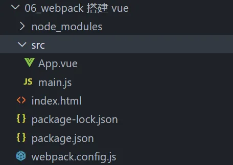
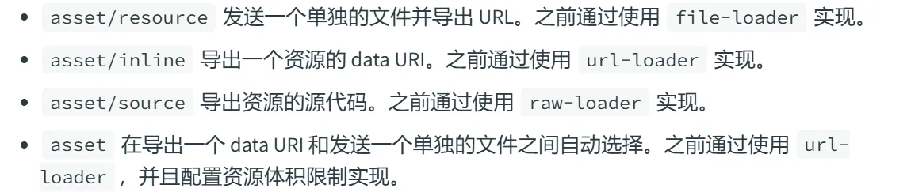
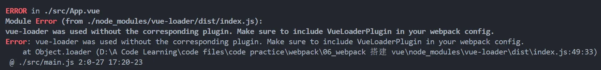
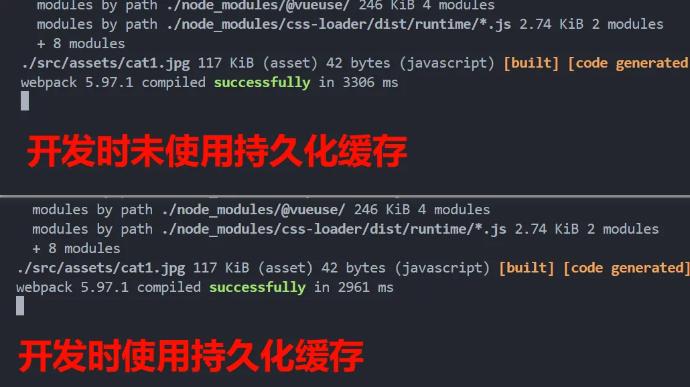
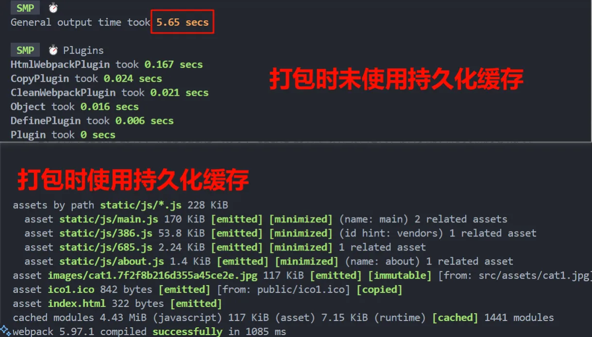

# webpack5 搭建 vue3 项目
#### 一、前期准备
1. npm init 初始化 package.json
2. 安装 webpack webpack-cli
> npm i webpack webpack-cli -D
3. 安装 vue 相关
> npm i vue -S
> npm i vue-loader -D
4. 创建文件，对应的结构如下

5. 配置打包入口 entry 和出口 output
```js
/** webpack.common.config.js */
const path = require("path");

module.exports = {
  entry: "./src/main.js",
  output: {
    name: "[name].js",
    // path.resolve() 方法会把一个路径或路径片段的序列解析为一个绝对路径
    // __dirname 表示当前文件所在的目录的绝对路径
    path: path.resolve(__dirname, "dist")
  }
}
```
6. 安装、配置 CSS 相关依赖
> npm i css-loader style-loader -D
```js
/** webpack.common.config.js */
module: {
  rules: [
    // 处理 css 文件；loader 的执行顺序是从右到左
    // style-loader 将解析后的 css 从 js 中抽离，放在头部的 style 中
    // css-loader 解析 css
    {test: /\.css$/, use:["style-loader", "css-loader"]}
  ]
}
```
7. 一些其他的依赖：html-webpack-plugin clean-webpack-plugin webpack-dev-server
> npm i html-webpack-plugin clean-webpack-plugin webpack-dev-server -D
```js
/** webpack.common.config.js */
// 在打包结束后，自动生成一个html文件，并把打包生成的js文件引入到这个html文件当中
const htmlWebpackPlugin = require("html-webpack-plugin");
// 在打包之前清空output配置的文件夹
const {CleanWebpackPlugin} = require("clean-webpack-plugin");

plugins: [
  new htmlWebpackPlugin({
    // template 属性指定了要使用的模板文件
    template: path.resolve(__dirname, "index.html"),
    // filename 属性指定了要生成的文件名
    filename: "index.html"
  }),
  new CleanWebpackPlugin()
]

// 开发服务器的配置
devServer: {
  open: true, // 自动打开浏览器
  port: 8888, // 指定端口号
  hot:true,   // 开启热更新
}
```
#### 二、安装一些依赖库
1. 安装 vuex vue-router
> npm i vuex vue-router -S
```js
/** router/index.js */
import { createRouter, createWebHistory } from 'vue-router'

const routes = [
  {
    path: '/',
    redirect: "/home",
    name: 'HomeRedirect'
  },
  {
    path: "/home",
    name: "Home",
    component: () => import("../view/home.vue")
  },  
  {
    path: '/about',
    name: 'About',
    // 不用 webpack 魔法注释，也能实现懒加载
    // 只不过加上魔法注释，可以给懒加载的模块命名
    component: () => import(/* webpackChunkName: "about" */'../view/about.vue')
  }
]

const router = createRouter({
  history: createWebHistory(),
  routes
})

export default router
```
2. 按需引入 Element Plus
> npm i element-plus -S

> npm install -D unplugin-vue-components unplugin-auto-import
```js
// 自动引入 Element Plus 组件
const AutoImport = require('unplugin-auto-import/webpack').default;
const Components = require('unplugin-vue-components/webpack').default;
const { ElementPlusResolver } = require('unplugin-vue-components/resolvers');

plugins: [
  AutoImport({
    resolvers: [ElementPlusResolver()],
  }),
  Components({
    resolvers: [ElementPlusResolver()],
  }),
]
```
#### 三、拆分 webpack.config.js
1. 安装 webpack-merge
> npm i webpack-merge -D   // 用于连接数组，合并对象
2. 为了区分开发和打包，将 config 配置文件拆分为三个，分别是共有的 webpack.common.config.js 开发时的 webpack.dev.config.js 以及打包时的 webpack.prod.config.js
#### 四、杂七杂八的配置
1. 配置 extensions：resolve 解析配置下的选项，在引入模块时不带文件后缀时，会来该配置数组里面依次添加后缀查找文件，许多第三方库引入 js 文件时也没有加上后缀
```js
/** webpack.common.config.js */
resolve: {
  extensions: ['.vue', '.ts', '.js', '.json'],
}
```
2. 资源配置：对于静态资源，webpack5 摒弃了之前的 url-loader  file-loader 和 raw-loader，使用以下四种 type 的类型来处理

> Data URL 是将资源（如图片、字体或其他二进制文件）以 Base64 或其他格式编码为字符串，然后直接嵌入到代码中；

> 文件 URL 是将资源以文件的形式存储在打包输出目录中，并返回该文件的路径（通常是一个相对或绝对 URL）。
3. 复制 public 文件夹到 dist 打包后的文件中：放在 public 中的资源文件不会被 webpack 打包，引用其中的资源时需要绝对路径。在开发环境中可以访问到，但由于 webpack 不会解析处理 public 文件，所以需要将 public 复制到 dist 中。这里可以使用 copy-webpack-plugin 插件
> npm i copy-webpack-plugin -D
```js
// 复制 public 文件夹到 dist 中
new CopyPlugin({
  patterns: [
    {
      from: path.resolve(__dirname, './public'), // 复制public下文件
      to: path.resolve(__dirname, './dist'), // 复制到dist目录中
      // 忽略 index.html 因为已经在 html-webpack-plugin 中配置了
      filter: source => {
        return !source.includes('index.html')
      }
    }
  ]
})
```
4. 抽取 css 样式文件：打包时将 css 抽离出来
> npm i mini-css-extract-plugin -D

在开发时通常是使用 style-loader 将 css 通过 style 标签插入到 html 中，这样便于开发时的热更新；而采用 MiniCssExtractPlugin 对热更新支持得不是很好，并且开发环境没有必要使用 hash。因此开发时采用 style-loader，而打包到生产时使用 MiniCssExtractPlugin。
```js
// 抽离 css 到单独的文件
const MiniCssExtractPlugin = require("mini-css-extract-plugin");
// 判断是开发环境
const isDev = process.env.NODE_ENV === "development"

// 处理 css 文件: loader 的执行顺序是从右到左
module: {
  rules: [
    {
      test: /\.css$/, 
      // 开发环境使用 style-loader 打包使用 MiniCssExtractPlugin
      use:[isDev ? "style-loader" : MiniCssExtractPlugin.loader, "css-loader"]
    }
  ]
}
```
5. 设置环境变量：通过 cross-env 可以兼容各系统的设置环境变量
> npm i cross-env -D
```js
"dev:dev": "cross-env NODE_ENV=development BASE_ENV=dev webpack serve --config webpack.dev.config.js",
"dev:test": "cross-env NODE_ENV=development BASE_ENV=test webpack serve --config webpack.dev.config.js",
"dev:pre": "cross-env NODE_ENV=development BASE_ENV=pre webpack serve --config webpack.dev.config.js",
"dev:pro": "cross-env NODE_ENV=development BASE_ENV=pro webpack serve --config webpack.dev.config.js",

"build:dev": "cross-env NODE_ENV=production BASE_ENV=dev webpack --config webpack.prod.config.js",
"build:test": "cross-env NODE_ENV=production BASE_ENV=test webpack --config webpack.prod.config.js",
"build:pre": "cross-env NODE_ENV=production BASE_ENV=pre webpack --config webpack.prod.config.js",
"build:pro": "cross-env NODE_ENV=production BASE_ENV=pro webpack --config webpack.prod.config.js",
```
#### 五、性能优化相关配置
1. 为了观察、测定打包过程中各项的数据，安装 speed-measure-webpack-plugin
> npm i speed-measure-webpack-plugin -D
但是这里有个坑：就是跟 vue-loader 以及 css-minimizer-webpack-plugin 会不兼容，查了资料之后发现是这个测速插件会更改引入插件的顺序，问题如下

做出以下的更改：在新建的测定打包速度的 config.js 中配置
```js
const prodWebpack = require("./webpack.prod.config");
const { merge } = require("webpack-merge");
// 分析打包速度
const SpeedMeasurePlugin = require("speed-measure-webpack-plugin");
const smp = new SpeedMeasurePlugin();
const { VueLoaderPlugin } = require('vue-loader');

let webpackConfig = merge(prodWebpack, {})
// console.log(webpackConfig)

// 为了处理 SpeedMeasurePlugin 跟 vue-loader 和 MiniCssExtractPlugin 不兼容问题
webpackConfig.plugins = webpackConfig.plugins.filter(
  (plugin) => !(plugin instanceof MiniCssExtractPlugin)
);
webpackConfig = smp.wrap(webpackConfig);
webpackConfig.plugins.push(new VueLoaderPlugin());
webpackConfig.plugins.push(miniExtractPluginConfig);

module.exports = webpackConfig
```
2. 为了观察打包后的文件大小，引入 webpack-bundle-analyzer
> npm i webpack-bundle-analyzer -D
```js
/** webpack,common.config.js */
// 分析打包后的文件大小
const { BundleAnalyzerPlugin } = require("webpack-bundle-analyzer");

let webpackConfig = merge(prodWebpack, {
  plugins: [
    new BundleAnalyzerPlugin()
  ]
})
```
3. 开启 cache 缓存：webpack5 引入 cache 缓存，对构建和打包都有较大幅度的提升
```js
/** webpack.common.config.js */

// 使用持久化缓存
cache: {
  type: "filesystem"
},
```


4. 限制 loader 的作用范围：一般对于第三方库，不需要使用 loader 来去处理，可以通过使用 include 和 exclude 来配置 loader 的作用范围
```js
/** webpack.common.config.js */
rules: [
  {
    // 只对项目 src 文件的 vue 进行 loader 解析
    include: [path.resolve(__dirname, "./src")], 
    test: /\.vue$/, 
    use: "vue-loader"
  }
]
```
5. 限定第三方模块的搜索范围：
  * 首先，这里涉及到模块的查询顺序问题。使用 require 和 import 引入模块时如果有准确的相对或者绝对路径,就会去按路径查询,如果引入的模块没有路径,会优先查询 node 核心模块,如果没有找到会去当前目录下 node_modules 中寻找,如果没有找到会从父级文件夹查找 node_modules ,一直查到系统 node 全局模块。
  * 但是这样会导致两个问题,一个是当前项目没有安装某个依赖,但是上一级目录下 node_modules 或者全局模块有安装,就也会引入成功,但是部署到服务器时可能就会找不到造成报错；另一个问题就是一级一级查询比较消耗时间。可以告诉 webpack 搜索目录范围,来规避这两个问题
```js
/** wepack.common.config.js */
modules: [path.resolve(__dirname, './node_modules'), "node_modules"]
```
6. 压缩 css : 	通过 css-minimizer-webpack-plugin
> npm i css-minimizer-webpack-plugin -D
```js
/** webpck.prod.config.js */
optimization: {
  minimizer: [
    // 压缩 css 文件
    new CssMinimizerPlugin()
  ]
}
```
7. 压缩 js : 通过内置的 terser-webpack-plugin; 由于上面重新配置了 minimizer 所以原本 webpack 使用 mode: "production" 时会自动开启的压缩 js 就失效了，需要重新配置下
```js
/** webpack.prod.config.js */
optimization: {
  minimizer: [
    // 压缩 js 文件
    new TerserPlugin({
      parallel: true, // 开启多线程压缩
      terserOptions: {
        compress: {
          pure_funcs: ["console.log"] // 删除 console.log
        }
      }
    })
  ]
}
```
8. 第三方库不参与打包，在 index.html 中用 cdn 引入，可以加快打包进度
```js
/** webpack.prod.config.js */
// 将一些库文件不参与打包，直接 cdn 引入
externals: {
  "vue": "Vue", // Vue 不打包，使用全局变量 Vue
  "vue-router": "VueRouter",
  "vuex": "Vuex",
  "axios": "axios",
  'element-plus': 'ElementPlus'
}
```
9. 对于 moment.js 通过 IgnorePlugin 打包时忽略本地的 local 文件，等到需要使用时再引入
```js
/** webpack.prod.config.js */
plugins: [
  //忽略 moment 下的 ./locale 目录
  new webpack.IgnorePlugin(/^\.\/locale$/, /moment$/),
];
```
```js
// 在使用的时候
import moment from "moment";
import "moment/locale/zh-cn"; // 手动引入
moment.locale("zh-cn");
```
10. 对于一些库，比如 echarts 可以不要全量引入，而是采用按需引入