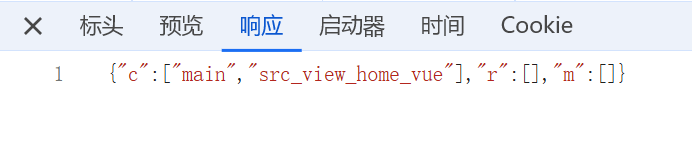

**前言：本篇浅谈下 webpack 的热更新原理**
1. 热更新的核心是依赖了一个包：webpack-dev-server；
2. 首先运行 webpack serve 时，会启动两个服务，一个是 http 本地服务器，提供 webpack 编译后的结果；另一个是 websocket 服务，可以实现客户端和服务器的双向通信，当有模块中的内容发生变化时，服务端通过 websocket 通知到客户端，由客户端发送请求去进行处理；
3. 主要流程：
    * 首先要实现热更新，webpack 全程监听文件的变化情况，当有文件发生变化，会对文件进行重新编译，并产生一个 hash 值；
    * 首次连接时，通过 websocket 将 hash1 值传给客户端，客户端进行保存。客户端这边可以保存多个 hash 值，每次有新的编译结果，webpack 就通过 websocket 发送一个新的 hash；如果是首次进行连接，那么只有一个 hash；
    
    * 此时，当代码发生变化，webpack 监听到后进行编译，同时会生成新的 hash2，通过 websocket 将 hash2 发送给客户端；
    
    * 客户端接受到 websocket 消息之后，拿到新的 hash 值，同时向服务端发送获取 json 数据的请求，目的是获取到发生了变化的代码块，也就是 chunk；而这个请求 json 数据的请求携带的是上一次的 hash 值，也就是 hash1;
    
    * 服务端收到 json 数据的请求之后，对比到收到的 hash 值跟自身打包产生最新的 hash 值不一样，那么就会找出变更的代码块；接着服务端将发生变更的代码块信息，也就是对应的 chunk 以 json 数据的形式发送给客户端 **(如下图，修改的文件是 src/view/home.vue)**；
    
    * 客户端接受到 json 数据之后，就知道了哪些代码块发生了变化，接着发送第二个请求，这个请求是一个 js 请求，携带上 hash1 值，向服务端获取发生了变更的代码模块，这时就是获取具体的 module；
    * 服务端接受到之后，也是做一个 hash 的对比，知道了是哪一个模块发生了变化，将最新的模块传给客户端；
    
    * 最后，客户端拿到最新的 module 模块代码，重新执行**依赖该模块的模块**，达到更新目的