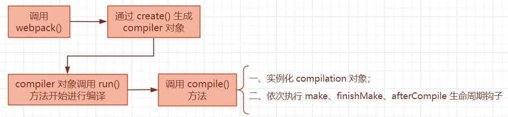

**前言：本篇浅谈下 webpack 的执行过程**
1. 首先将配置文件中配置的选项和执行的 shell 命令中携带的参数进行合并，得到最终的选项参数；
2. 将得到的参数，也就是整个的配置选项的对象传给 webpack() 函数，去执行内部有一个 create() 方法，得到一个 compiler 对象；是一个重要的对象，在 webpack 的整个生命周期中都存在；
3. 而 compiler 对象是通过 Compiler 类 new 出来的；在 Compiler 类中初始化了大量的钩子函数，这些钩子会在 webpack 执行过程中依次触发。
```js
class Compiler {
  constructor() {
    this.hooks = Object.freeze({
			initialize: new SyncHook([]),
			shouldEmit: new SyncBailHook(["compilation"]),
			done: new AsyncSeriesHook(["stats"]),
			afterDone: new SyncHook(["stats"]),
			additionalPass: new AsyncSeriesHook([]),
			beforeRun: new AsyncSeriesHook(["compiler"]),
			run: new AsyncSeriesHook(["compiler"]),
			emit: new AsyncSeriesHook(["compilation"]),
			assetEmitted: new AsyncSeriesHook(["file", "info"]),
			afterEmit: new AsyncSeriesHook(["compilation"]),
			thisCompilation: new SyncHook(["compilation", "params"]),
			compilation: new SyncHook(["compilation", "params"]),
			normalModuleFactory: new SyncHook(["normalModuleFactory"]),
			contextModuleFactory: new SyncHook(["contextModuleFactory"]),
			beforeCompile: new AsyncSeriesHook(["params"]),
			compile: new SyncHook(["params"]),
			make: new AsyncParallelHook(["compilation"]),
			finishMake: new AsyncSeriesHook(["compilation"]),
			afterCompile: new AsyncSeriesHook(["compilation"]),
			readRecords: new AsyncSeriesHook([]),
			emitRecords: new AsyncSeriesHook([]),
			watchRun: new AsyncSeriesHook(["compiler"]),
			failed: new SyncHook(["error"]),
			invalid: new SyncHook(["filename", "changeTime"]),
			watchClose: new SyncHook([]),
			shutdown: new AsyncSeriesHook([]),
			infrastructureLog: new SyncBailHook(["origin", "type", "args"]),
			environment: new SyncHook([]),
			afterEnvironment: new SyncHook([]),
			afterPlugins: new SyncHook(["compiler"]),
			afterResolvers: new SyncHook(["compiler"]),
			entryOption: new SyncBailHook(["context", "entry"])
    })
  }
}
```
而这些钩子是基于 tapable 库实现的；而 tapable 库的本质则是基于发布订阅模式，通过在一系列钩子中使用 tap() 注册回调，然后在指定的时刻通过 call() 执行回调；这样在 webpack 执行过程中会在特定时刻执行钩子函数，插件监听到对应钩子的执行去触发回调；
```javascript
  // tapable 中一共提供了九种 hook
  // 这里以最基本的同步 hook 举例

  let hook = new SyncHook(["a", "b"]);

  // 注册绑定事件
  hook.tap("flag1", (args1, args2) => {
    // 执行一些代码
    console.log("flag1:", args1, args2)
  })

  // 执行注册绑定的回调
  hook.call("参数1", "参数2")
```
4. 在创建 compiler 对象之后，也会拿到配置选项中的 plugins 选项内容，去注册每一个插件；插件如果是函数，就直接执行；如果是对象，那么就执行对象中的 apply() 方法；接着会将传入的 webpack 配置中的大部分选项转成插件，比如说：mode、devtools、entry、output 等等，判断如果有对应的选项，就 new 一个对应的 plugin，来去初始化；
```javascript
const createCompiler = rawOptions => {
  ...

  // 二、注册插件 plugins
  if (Array.isArray(options.plugins)) {
    // 拿到 options 中的 plugins 选项
    for (const plugin of options.plugins) {
      if (typeof plugin === "function") {
        // 如果每一个插件是函数
        plugin.call(compiler, compiler);
      } else {
        // 如果每一个插件是对象，去执行其中的 apply() 方法
        plugin.apply(compiler);
      }
    }
  }
  ...

  // WebpackOptionsApply().process() 这个方法的作用就是将配置项中的大部分选项转成插件
	new WebpackOptionsApply().process(options, compiler);
}


class WebpackOptionsApply {
  process(options, compiler) {
    ...

    // 入口文件 entry 插件
    new EntryOptionPlugin().apply(compiler);
    compiler.hooks.entryOption.call(options.context, options.entry);
  }
}
```
5. 接着会去调用 compiler.run() 方法，在 run() 方法中主要就是执行该方法内部定义的又一个 run()，接着在这个 run() 中会依次执行在 compiler 对象中初始化的钩子函数，依次是 beforeRun、run，在这些钩子函数对应阶段注册的 plugin 就会去执行；也就是说注册的 plugin 插件就在 webpack 提供的生命周期钩子中去处理代码；
```javascript
class Compiler {
  ...

  run(callback) {
    const run = () => {
      // 执行在 beforeRun 中注册的 plugin
      this.hooks.beforeRun.callAsync(this, err => {
        if (err) return finalCallback(err);

        // 执行在 run 中注册的 plugin
        this.hooks.run.callAsync(this, err => {
          if (err) return finalCallback(err);

          this.readRecords(err => {
            if (err) return finalCallback(err);

            // 执行 compile 方法
            this.compile(onCompiled);
          });
        });
      });
    };
  }
}
```
```javascript
// 例如在 NodeEnvironmentPlugin 这个 plugin 中就在 beforeRun 的生命周期钩子中注册了对应的回调
class NodeEnvironmentPlugin {
  apply(compiler) {
    ...

    /**
     * 也就是说，在上面的 this.hooks.beforeRun.callAsync() 执行的时候，下面注册的回调就会执行
     * if (compiler.inputFileSystem === inputFileSystem) {
        compiler.fsStartTime = Date.now();
        inputFileSystem.purge();
      }
     *  
     */
    compiler.hooks.beforeRun.tap("NodeEnvironmentPlugin", compiler => {
      if (compiler.inputFileSystem === inputFileSystem) {
        compiler.fsStartTime = Date.now();
        inputFileSystem.purge();
      }
    });
  }
}
```
6. 接着就是去执行 compiler 对象中的 compile() 方法；这个方法内部主要也是依次会去执行 beforeCompile、compile、make、finishMake、afterCompile 这个五个钩子函数；
```javascript
compile(callback) {
  const params = this.newCompilationParams();
  
  // 执行 beforeCompile 钩子中注册的回调
  this.hooks.beforeCompile.callAsync(params, err => {
    if (err) return callback(err);

    // compile 钩子执行
    this.hooks.compile.call(params);

    // 创建 compilation 对象
    const compilation = this.newCompilation(params);

    // 执行 make 中注册的回调
    this.hooks.make.callAsync(compilation, err => {

      // 执行 finishMake 注册的回调
      this.hooks.finishMake.callAsync(compilation, err => {

        process.nextTick(() => {
          compilation.finish(err => {
            compilation.seal(err => {
              // 执行 afterCompile 注册的回调
              this.hooks.afterCompile.callAsync(compilation, err => {
                // afterCompile 钩子执行到这里，去执行 callback 回调，回到 onCompiled 
                return callback(null, compilation);
              });
            });
          });
        });
      });
    });
  });
}
```
7. 在执行 compile 和 make 这两个钩子之间，会创建一个 compilation 对象实例，通过这个 compilation 来真正开始编译模块；而随着 compilation 对象的创建完成，表示 webpack 的准备阶段完成，下一步就是 modules 模块的生成阶段，进入到 make 钩子函数执行；
8. 上面说到，webpack 配置的选项大部分会被转成插件去初始化，entry 入口选项就是；对应的 entry 相关插件在初始化时，将一个回调通过 tap 注册在了 make 钩子中，当 webpack 走到 make 阶段时，调用 make.call()，执行注册的回调，在回调中执行 compilation.addEntry() 方法，也就是从 entry 入口文件开始编译；
```javascript
class EntryOptionPlugin {
  apply(compiler) {
    compiler.hooks.entryOption.tap("EntryOptionPlugin", (context, entry) => {
      EntryOptionPlugin.applyEntryOption(compiler, context, entry);
      return true;
    });
  }

  // 这里根据 entry 选项配置的不同使用不同的 plugin
  static applyEntryOption(compiler, context, entry) {
    if (typeof entry === "function") {
      const DynamicEntryPlugin = require("./DynamicEntryPlugin");
      new DynamicEntryPlugin(context, entry).apply(compiler);
    } else {
      const EntryPlugin = require("./EntryPlugin");
      for (const name of Object.keys(entry)) {
        const desc = entry[name];
        const options = EntryOptionPlugin.entryDescriptionToOptions(compiler,name,desc);
        for (const entry of desc.import) {
          // 这里重点看下 EntryPlugin
          new EntryPlugin(context, entry, options).apply(compiler);
        }
      }
    }
  }
}

class EntryPlugin {
  apply(compiler) {
    ...
    
    // 在 make 阶段添加的回调；也就是说，在 make 钩子调用 call 时，会走到这里
    // 从这里开始处理入口文件
    compiler.hooks.make.tapAsync("EntryPlugin", (compilation, callback) => {
        compilation.addEntry(context, dep, options, err => {
        callback(err);
      });
    });
  }
}
```
>注意：在注册回调时，会将 compilation 对象传到回调函数中，因为编译的操作都是依赖于 compilation 对象的；
9. 编译时，会从 entry 选项定义的入口文件开始，将其编译成一个模块；调用的入口函数是 compilation.addEntry()；过程就是从入口文件开始创建 module 模块；由于一个文件模块可能依赖多个其他的文件，所以先做了一个模块的分解，将每一个模块添加到一个队列中；
10. 接着就去执行 buildModule() 方法，执行每一个 module 的 build() 方法，开始对每一个 module 开始构建编译（会判断一个 module 需不需要构建，如果已经构建过，那么就不需要构建了）；
    > module.build() 是一个多态的写法，真正实现的位置是 NormalModule.js 文件中，NormalModule 是继承 Module 类的
11. 编译 module 的核心就是去执行 runLoaders() 方法，遍历所有的 loader 对匹配到的模块内容进行处理，将模块转变成标准的 js 模块；
    > runLoaders() 是 loader-runner 库中的一个方法
```javascript
// 下面来看一下整个调用的过程

// 1. 调用 addEntry
compilation.addEntry(context, dep, options, err => {
  callback(err);
});
// 2. 调用 _addEntryItem
addEntry(context, entry, optionsOrName, callback) {
  this._addEntryItem(context, entry, "dependencies", options, callback);
}
// 3. 调用 addModuleTree
_addEntryItem(context, entry, target, options, callback) {
  this.addModuleTree()
}
// 4. 调用 handleModuleCreation
addModuleTree({ context, dependency, contextInfo }, callback) {
  // 创建模块之间的图结构，并对模块进行分解
  this.handleModuleCreation()
}
// 5. 调用 factorizeModule 执行 _handleModuleBuildAndDependencies
handleModuleCreation() {
  // 对模块进行分解，因为入口文件中可能依赖多个文件
  // 将模块加入到队列中
  this.factorizeModule()

  // 开始对 module 进行编译
  this._handleModuleBuildAndDependencies(originModule, module, recursive, callback);
}
// 6. 执行 buildModule
_handleModuleBuildAndDependencies() {
  ...
  // 开始编译模块
  this.buildModule(module, err => {})
}
// 7. 将模块和回调函数添加到构建队列中
buildModule(module, callback) {
  this.buildQueue.add(module, callback);
}
// 8. Compilation 中的 buildQueue
class Compilation {
  constructor() {
    ...
    this.buildQueue = new AsyncQueue({
      name: "build",
      parent: this.factorizeQueue,
      processor: this._buildModule.bind(this)
    });
  }
  ...
  // 9. 执行 factory.create
  _buildModule(module, callback) {
    ...
    // 执行 module.build 开始构建
    // 注意这里使用了 class 类的多态
    // 这里的 module.build 方法其实是 NormalModule 类继承了 Module 类并对重写的 build 方法
    module.build()
  }
}
// 10. NormalModule 中的 build() 方法返回了 _doBuild
class NormalModule extends Module {
  build(options, compilation, resolver, fs, callback) {
    return this._doBuild(options, compilation, resolver, fs, hooks, err => {
      ...

      // 11. 在 _doBuild 传入的 err 回调中，调用 parse 进行 ast 的转换
      let result;
      result = this.parser.parse(this._ast || source, {
        source,
        current: this,
        module: this,
        compilation: compilation,
        options: options
      });
    })
  }
}
```
12. 调用 parse() 方法将得到的 js 转成 ast 抽象语法树，目的是为了得到当前模块的依赖关系，看还依赖哪些模块，对依赖的模块递归的进行编译；
13. 当 entry 入口文件模块及其依赖的模块编译完成之后，make 阶段执行完毕；接着调用 finishMake 钩子，在钩子注册的回调中执行 compilation 的 seal(), 即 compilation.seal()，进入到 seal 阶段，生成 chunk；生成 chunk 会遵循几个规则：
    * entry 入口的每个文件模块及其依赖的模块会生成一个 chunk；
    * 动态引入的 module 也会生成一个 chunk；
14. 在 seal 阶段会有大量的钩子函数触发，初始化的插件在对应的钩子触发时就会执行，在生成 chunk 过程中进行处理；
15. 当所有的 chunk 生成，那么 compilation 的工作也完成了，seal 阶段也结束；最终就是调用 emitAssets() 方法，将编译后的文件输出到文件夹

#### 一些概念
##### 一、compile 对象和 compilation 对象的区别：
* compile 对象贯穿 webpack 的整个生命周期，该对象上挂载了许多钩子函数，从编译开始到编译结束，插件通过在钩子上注册回调，等到 webpack 运行到指定的钩子时，就执行对应注册的回调，对编译中各个时期的代码进行处理；
* compilation 对象存在于 compiler 对象的 beforeCompile 阶段到 compilation 对象的 seal 阶段；当文件发生修改，重新编译时，都会重新创建一个 compilation 对象；一个 compilation 对象就会对应当前的模块资源、模块编译生成的内容等

* 流程图：

##### 二、module、chunk、bundle 的区别
* module: 对于 webpack 来说，编写的每一个文件都是一个个的 module；
* chunk: chunk 就是 webpack 在打包过程中多个 module 的集合；webpack 打包时都是指定一个入口文件开始，然后这个文件 module 依赖另一个文件模块，模块再依赖另一个模块，webpack 通过这些依赖来将所有的文件进行打包；而这些相互依赖的文件就形成了 chunk;
* bundle: bundle 是文件打包之后的产物，就是打包生成的代码文件。
